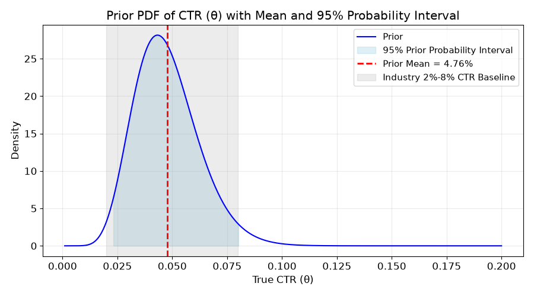
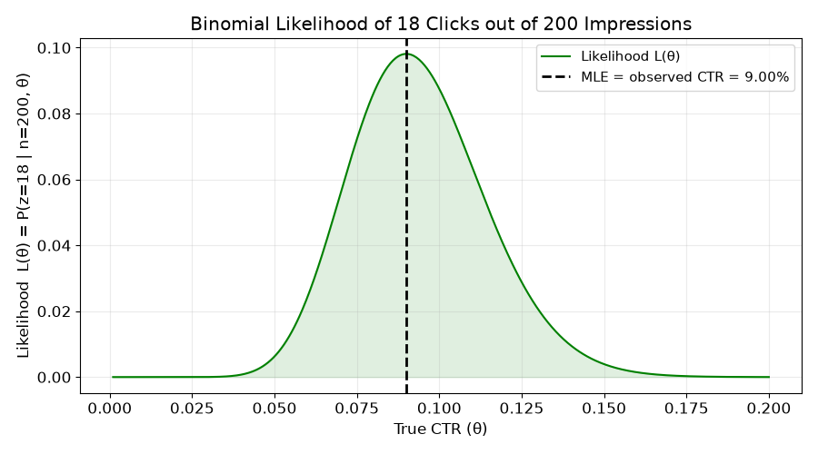
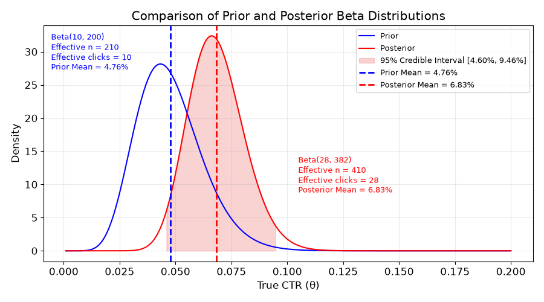

# 小组作业 2 – 贝叶斯统计推断 (Bayesian Statistical Inference)

> **完整可运行代码**：<https://github.com/woodywang/hpu/blob/master/6000-2/DSCI6000_hw2.py>
> 报告中所有数值结果与三张图表均由该脚本一次运行直接生成，可完整复现。代码全文另见文末附录。
> 图片文件位于同级 `figures/` 目录，由脚本自动输出；重新运行脚本即可刷新报告全部插图。
> 运行环境：Python 3 + `numpy` / `scipy` / `matplotlib`（可直接粘贴至 Google Colab 运行，无需额外配置）。

## Part 1：业务场景概述

### 1. 项目背景
一家手机游戏工作室正在测试一则新的首页横幅广告,希望评估该广告是否能够提高用户点击率,并决定是否将其推广至全站。核心评估指标为点击率（Click-Through Rate，CTR）= 用户点击次数 / 广告展示次数 × 100%。根据行业历史基准，同类广告的CTR通常稳定在 2% ~ 8% 之间，这一区间构成了团队的先验信念。因此可作为贝叶斯分析中的先验信息（Prior Information）。

### 2. 实验数据
工作室开展了小规模试点测试，本次试点实验共收集到以下数据，按样本计算，观测CTR为 18/200 * 100% = 9.0%
| 指标       | 数值 |
| :---------:  | :---: |
| 广告展示次数| 200 |
| 用户点击次数| 18  |
| 实际观测CTR | 9%  |
但该9.0%仅是200次展示下的样本均值，受随机波动影响较大，未必代表真实长期CTR。若直接以此作为全量上线的依据，可能高估或低估广告效果。因此，需要在决策前进行贝叶斯更新：将行业历史先验（2%~8%）与本次试点数据（200次展示、18次点击）相结合，得出真实CTR的后验分布。该分布能量化不确定性，为是否全量推广提供更稳健的概率化证据。

## Part 2：贝塔先验的选择与论证（Prior Justification）

### 1. 先验分布形式
设真实CTR参数为 θ（θ∈[0,1]），我们为其赋予Beta先验分布：
θ∼Beta(α,β)
选择Beta分布的原因有二：其一，Beta分布定义域为(0,1)，与CTR的概率属性天然匹配；其二，Beta分布是二项分布的共轭先验，可保证后验分布解析可求，无需数值模拟。

### 2. 超参数 α 与 β 的选取
行业历史数据显示同类广告CTR稳定在 2%~8% 之间。为匹配该区间，我们采用矩估计法确定超参数。取先验均值位于区间中值 5%，并设定先验标准差 σ≈0.015，使得约95%的先验质量落入2%~8%范围（利用正态近似下均值±2σ覆盖95%的原则）。
由Beta分布性质：
Beta分布的均值为 $\frac{\alpha}{\alpha + \beta}$，方差为 $\frac{\alpha\beta}{(\alpha + \beta)^2(\alpha + \beta + 1)}$。令 $\mu = 0.05$，$\sigma = 0.015$，设先验强度 $n = \alpha + \beta$，由 $\sigma^2 = \frac{\mu(1-\mu)}{n+1}$，解得 $n \approx 210$。
进而得出：α=μ⋅n=0.05×210=10.5，β=(1−μ)⋅n=0.95×210=199.5
根据以上计算结果，并为便于后文的"伪计数"（pseudo-count）解释，将超参数取整设定为：α=10，β=200，α+β=210。此时先验均值 α/(α+β)=10/210=0.0476，即 4.76%（略低于目标值 5%，系取整所致；若要求均值恰为 5.00%，可直接采用 Beta(10.5, 199.5)，Beta 分布并不要求参数为整数）。该先验分布在 [2%, 8%] 区间上的概率质量为 96.45%，符合超参数 α 和 β 的选取标准。
最终选取 Beta(α=10, β=200) 作为先验分布。

### 3. 超参数的业务含义解读
在Beta分布中，α 和 β 可直观地理解为“有效先验样本中的成功次数和失败次数”：伪点击 α=10，相当于在历史经验中，我们“见过”约 10 次点击；伪未点击 β=200：相当于在历史经验中，我们“见过”约 200 次未点击；先验强度 α+β=210：相当于先验信息等效于 210 次历史展示所积累的认知强度。这一等效样本量规模适中，既体现了行业历史基准的参考价值，又不会过于强势，确保后续试点数据（200次展示）有足够空间对先验进行有效更新。

### 4. 先验分布对2%~8%区间的匹配性验证
#### （1）先验均值验证
E[θ] = α/(α+β)=10/210=0.0476，即4.76%.
该值接近2%~8%区间的中点（5%），符合行业基准预期。

#### （2）概率质量验证
从两个互补的角度验证先验与行业区间的吻合程度：

**角度一：先验的95%等尾概率区间。** 计算Beta(10, 200)的分位数：
- 2.5%分位数（下限）= 0.0232（即 2.32%）
- 97.5%分位数（上限）= 0.0802（即 8.02%）

即先验的95%概率质量落在 [2.32%, 8.02%]，与行业区间 [2%, 8%] 几乎重合。

**角度二：行业区间上的概率质量。** 直接计算先验落入行业区间的概率：
P(0.02 ≤ θ ≤ 0.08) = F(0.08) − F(0.02) = **96.45%**

两个角度互为印证：在观测任何新数据之前，我们已有 96.45% 的把握认为该广告的真实CTR处于行业历史基准区间 2%~8% 内，这一定量结论精准表达了团队的先验信念。（注意两个数字描述的是不同对象：95% 是"先验区间"的覆盖概率，96.45% 是"行业区间"上的概率质量，两者接近正说明先验设定精准。）

### 5. 先验概率密度分布图
图1为点击率（CTR）的先验概率密度分布图。横轴是真实点击率，纵轴是概率密度。蓝色曲线表示点击率的先验分布，基于行业历史经验形成。浅蓝色区域表示95%先验概率区间，即有95%可能真实点击率在此区间。红色虚线表示先验分布均值为4.76%，落在行业历史CTR通常所在的2% - 8%区间（灰色区域）内，表明先验设定合理参考了行业常规情况。


图1 先验概率密度分布图

## Part 3：二项似然函数（Binomial likelihood）

### 1. 二项似然函数原理阐述

对于给定的展示次数 n 和真实点击率 θ，点击次数 z 服从二项分布 Binomial(n,θ)。二项分布的概率质量函数为

$$P(Z=z \mid n, \theta) = \binom{n}{z}\,\theta^{z}\,(1-\theta)^{n-z}, \qquad \binom{n}{z} = \frac{n!}{z!\,(n-z)!}$$

其中 $\binom{n}{z}$ 是组合数。在似然函数的视角下，我们将 z 视为已观测到的常数，θ 视为变量，所以似然函数 L(θ) 就是在给定观测数据下，关于参数 θ 的函数。注意组合数 $\binom{n}{z}$ 不依赖于 θ，因此它只是一个不影响 θ 相对可能性的归一化常数——这也正是后验分布只由 $\theta^{z}(1-\theta)^{n-z}$ 这一核心项与先验相乘决定的原因。

### 2. 本次试点测试的似然函数表达式

已知在试点测试中，观察值 n=200，z=18，那么似然函数 L(θ) 的表达式为：

$$L(\theta) = \binom{200}{18}\,\theta^{18}\,(1-\theta)^{200-18} = \frac{200!}{18!\,(200-18)!}\,\theta^{18}\,(1-\theta)^{182}$$

该似然函数的物理含义是：在任意给定真实点击率 θ 的前提下，观测到本次试点 18 次点击、182 次未点击结果的相对可能性。

### 3. 似然函数定义
定义本次试点测试的似然函数的代码如下。我们同时给出手写公式与 `scipy.stats.binom` 两种实现，互为交叉验证：

```python
# 定义二项式似然函数与对数似然函数 stated

def binomial_likelihood(theta, n, z):
    """Likelihood of observing z clicks in n impressions given θ."""

    comb = math.factorial(n) / (math.factorial(z) * math.factorial(n - z))
    return comb * (theta**z) * ((1 - theta)**(n - z))

def binomial_log_likelihood(theta, n, z):
    """Log-likelihood of observing z clicks in n impressions given θ."""

    return stats.binom.logpmf(z, n, theta)

# 手写公式与 scipy.stats.binom.pmf 互为交叉验证，应得到相同结果
lik_manual = binomial_likelihood(sample_ctr, n_impressions, n_clicks)
lik_scipy = stats.binom.pmf(n_clicks, n_impressions, sample_ctr)
loglik = binomial_log_likelihood(sample_ctr, n_impressions, n_clicks)

print(f'''Likelihood of observing {n_clicks} clicks in {n_impressions} impressions at θ = {sample_ctr:.2%}:
    manual formula      = {lik_manual:.10f}
    scipy binom.pmf     = {lik_scipy:.10f}
    log-likelihood      = {loglik:.6f}   (= ln {lik_manual:.6f})''')

# 定义二项式似然函数与对数似然函数 completed
```

计算结果：

```
Likelihood of observing 18 clicks in 200 impressions at θ = 9.00%:
    manual formula      = 0.0981126045
    scipy binom.pmf     = 0.0981126045
    log-likelihood      = -2.321639   (= ln 0.098113)
```

两种实现得到完全一致的似然值 L(0.09) = 0.0981，对数似然为 ln(0.0981) = −2.3216（实际建模中常用对数似然，因为连乘会迅速下溢，取对数后化为求和，数值上更稳定）。

### 4. 似然函数曲线

将 θ 在 (0, 0.2) 上取值并逐点计算 L(θ)，即可画出似然函数曲线：

```python
# 绘制二项似然函数曲线图 stated

# 似然函数是关于θ的函数：给定观测数据(200次展示, 18次点击)，不同θ值的相对合理性
lik_curve = stats.binom.pmf(n_clicks, n_impressions, theta)

fig, ax = plt.subplots()
ax.plot(theta, lik_curve, color='green', label='Likelihood L(θ)')
ax.fill_between(theta, lik_curve, color='green', alpha=0.12)

# 似然函数在θ = 18/200 = 9%处取得最大值（最大似然估计MLE）
ax.axvline(sample_ctr, color='black', linestyle='--', linewidth=2,
           label=f'MLE = observed CTR = {sample_ctr:.2%}')

ax.set_xlabel('True CTR (θ)')
ax.set_ylabel('Likelihood  L(θ) = P(z=18 | n=200, θ)')
ax.set_title('Binomial Likelihood of 18 Clicks out of 200 Impressions')
ax.legend(fontsize=11)
plt.tight_layout()
save_figure('fig2_likelihood.png')      # 保存图片供报告引用
plt.show()

# 绘制二项似然函数曲线图 completed
```


图2 二项似然函数曲线图

图2 展示了在观测数据固定为"200次展示、18次点击"的条件下，似然函数 L(θ) 随 θ 的变化。曲线在 θ = 18/200 = 9%（黑色虚线）处取得最大值，该点即最大似然估计（MLE），也就是不借助任何先验信息、仅由数据本身给出的 CTR 估计。

需要强调的是，**似然函数不是 θ 的概率分布**：它在 θ 上的积分并不等于 1，纵轴表示的是"在该 θ 下观测到当前数据的概率"，而非"θ 取该值的概率"。要得到关于 θ 的概率陈述，必须按贝叶斯定理把它与先验相乘并归一化，这正是第 4 部分要做的事。

似然函数 L(θ) 能告诉我们在给定观测数据（200次展示，18次点击）的情况下，不同的 θ 值作为真实点击率的相对合理性。具体来说，似然函数值越大的 θ 值，意味着在该 θ 取值下，观测到当前数据（18次点击，200次展示）的可能性越高，即该 θ 值作为真实点击率越合理；似然函数值越小的 θ 值，意味着在该 θ 取值下，观测到当前数据的可能性越低，即该 θ 值作为真实点击率越不合理。

## Part 4：后验计算和可视化（Posterior Calculation and Visualization）

### 1. 共轭更新计算
我们已知先验分布选择为 Beta 分布，根据共轭分布的性质，当似然函数为二项分布时（本次广告点击测试符合二项分布，即只有点击和未点击两种结果），后验分布也为 Beta 分布。
- 先验分布设定为 Beta(α, β)，其中根据行业历史 CTR 通常在 2% - 8% 之间，我们取 α = 10，β = 200。在试点测试中，有 200 次展示，18 次点击，那么未点击数为 200 - 18 = 182 次。
- 通过共轭更新，后验分布为 Beta(α + 18, β + 182)，即 Beta(10 + 18, 200 + 182) = Beta(28, 382)。 

### 2. 后验均值计算及与 observed CTR 区分
- ‌**后验均值**‌：对于 Beta 分布 Beta(α, β)，其均值计算公式为 α / (α+β)。对于后验分布 Beta(28, 382)，后验均值为 28 /(28 + 382) = 28/410 = 0.0683，即 6.83%。
- ‌**与 observed CTR 区分**‌：observed CTR（观测点击率）是根据试点测试数据直接计算得到的，即 18/200=0.09，也就是 9%。它仅仅基于本次试点测试的样本数据。而后验估计是结合了先验信息和试点测试数据，通过贝叶斯更新得到的对真实 CTR 的估计，它考虑了我们对行业的先验认知，比单纯的 observed CTR 更加全面和稳健。
- ‌**后验均值为何落在 4.76% 与 9% 之间**‌：Beta-二项共轭下，后验均值恰好是先验均值与观测CTR的加权平均，权重即两者各自的等效样本量：

$$E[\theta \mid \text{data}] = \frac{\alpha+\beta}{\alpha+\beta+n}\cdot\frac{\alpha}{\alpha+\beta} \;+\; \frac{n}{\alpha+\beta+n}\cdot\frac{z}{n} = \frac{210}{410}\times 4.76\% + \frac{200}{410}\times 9.00\% = 6.83\%$$

  本例中先验等效样本量（210）与试点样本量（200）几乎相当，权重约为 51.2% : 48.8%，因此后验均值几乎正好落在两者中间。这就是贝叶斯"收缩"（shrinkage）效应：小样本观测到的 9% 被行业经验向下拉回到 6.83%，从而避免了因 200 次展示的随机波动而高估广告效果。

### 3. 不确定性的量化变化

除均值移动外，更新还改变了分布的离散程度：

| 指标 | 先验 Beta(10, 200) | 后验 Beta(28, 382) | 变化 |
| :--- | :---: | :---: | :---: |
| 均值 | 4.76% | 6.83% | +2.07 个百分点 |
| 标准差 | 1.466% | 1.244% | 收窄 15.1% |
| 95% 区间宽度 | 5.70 个百分点 | 4.86 个百分点 | 收窄 14.7% |

不确定性确有下降，但幅度是**温和的（约15%）而非剧烈的**——原因同样在于先验等效样本量（210）与试点数据量（200）相当，200 次展示所能提供的信息量与既有先验大致持平，因此只能把不确定性压缩约六分之一。这一事实是第 6 部分建议"先灰度扩量、再全量上线"的直接依据。

### 4. 先验分布与后验分布的比较
图3是先验分布与后验分布的比较图，该图展示了先验和后验Beta分布，先验分布为Beta(10, 200)，均值约4.76%，后验分布为Beta(28, 382)，均值约6.83%。后验分布相较于先验分布，峰值右移且更加集中，反映了结合新数据后对真实点击率估计的变化，不确定性降低。


图3 先验分布与后验分布比较图

- **先验分布**：蓝色曲线代表先验分布，标注为“Beta(10, 200)”。说明先验分布的参数为α=10，β=200。同时还标注了“Effective n = 210”（先验等效展示次数为 α+β = 210），“Effective clicks = 10”（先验等效点击次数为 α = 10），“Prior Mean = 4.76%”（先验均值为4.76%）。蓝色虚线标出先验均值位置。
- **后验分布**：红色曲线代表后验分布，标注为“Beta(28, 382)”。说明后验分布的参数为α=28，β=382。同时标注了“Effective n = 410”（后验等效展示次数为 α+β = 28+382 = 410，即 210 次先验等效展示 + 200 次实际展示），“Effective clicks = 28”（后验等效点击次数为 α = 28，即 10 次先验等效点击 + 18 次实际点击），“Posterior Mean = 6.83%”（后验均值为6.83%）。红色虚线标出后验均值位置，粉色阴影为 95% 可信区间 [4.60%, 9.46%]。
- **口径说明**：图中先验与后验的 “Effective n / Effective clicks” 采用统一的**等效样本量**口径（即 α+β 与 α），而非实际观测数。这样两个标注框才可直接对比，并直观体现"先验 210 + 数据 200 = 后验 410"的信息累加关系。
- **分布比较**：从图中可以看出，后验分布相较于先验分布，峰值向右移动，说明结合新的数据（展示和点击情况）后，对真实CTR的估计均值从4.76%提升到了6.83%，同时后验分布比先验分布更加集中（标准差由 1.466% 降至 1.244%），表明不确定性有所降低。

### 5. 信念更新解释
先验分布反映了我们在没有看到本次试点测试数据之前，基于行业历史经验对广告 CTR 的信念，其均值大约在 4.76% 附近。从图3中可以看出，当我们加入了试点测试的数据后，后验分布相较于先验分布发生了右移，峰值也有所变化，后验均值变为 6.83%。这表明我们的信念根据新的数据得到了更新，我们对广告真实 CTR 的估计变得更大，同时分布也变得更加集中，说明我们对 CTR 的不确定性在减小。也就是说，通过试点测试的数据，我们对广告的 CTR 有了更明确和更偏向于较高值的认知。

## Part 5：可信区间与贝叶斯解释（Credible Interval and Bayesian Interpretation）

### 1. 概念区分：可信区间 vs 置信区间
在进行区间估计时，需严格区分两大统计学派的不同逻辑：
- **频率学派的置信区间（Confidence Interval）**：其含义为“若重复多次抽样，每次构造一个95%置信区间，则大约95%的区间会包含真实参数”。它无法对当前这一次试验的真值作出概率陈述。
- **贝叶斯学派的可信区间（Credible Interval）**：直接描述为“在给定当前数据和先验信息下，真实参数落在该区间内的后验概率为95%”。这正是业务决策者最直观、最需要的概率化解读。

本报告采用贝叶斯可信区间，使用后验分布的 2.5% 和 97.5% 分位数构造等尾可信区间（Equal-tailed Credible Interval）。

### 2. 95%可信区间的计算
根据第4部分，后验分布为：θ∣Data∼Beta(28, 382)
使用后验分布的2.5%和97.5%分位数计算95%可信区间，代码如下：

``` 
# 计算后验贝塔分布可信区间 stated

ci_low, ci_high = posterior.ppf([0.025, 0.975])    # 计算后验贝塔分布的95%等尾概率区间

display(Markdown(
    f"**95% credible interval:** [{ci_low:.2%}, {ci_high:.2%}]"
))
print(f"95% credible interval: [{ci_low:.2%}, {ci_high:.2%}]")

# 计算后验贝塔分布可信区间 completed
```

运行输出：

``` 
95% credible interval: [4.60%, 9.46%]
```

即该广告真实CTR的 95%可信区间为 [4.60%, 9.46%]。

### 3. 贝叶斯语言解读
根据当前先验信息（行业历史基准2%~8%）和试点观测数据（200次展示，18次点击），我们有 95%的概率相信，该新横幅广告的真实CTR落在 4.60% 至 9.46% 之间。这是一个关于参数 θ 本身的直接概率陈述——θ 在贝叶斯框架下是一个随机变量，我们对它的信念由后验分布 Beta(28, 382) 完整刻画。它不涉及"重复抽样"这一假想过程，因此可以直接用于业务决策。

### 4. 直接的后验概率陈述

可信区间只是后验分布的一种摘要。既然后验分布已经完整给出，我们可以针对任意业务关心的阈值直接计算概率 P(θ > t | data)，这是贝叶斯方法相对频率学派最实用的优势：

```python
# 计算支撑上线决策的后验概率 stated

print('后验概率陈述（Posterior probability statements）:')
for threshold, note in [(0.02, '行业最差基准'), (0.05, '行业中位水平'),
                        (0.06, '业务盈亏平衡假设值'), (0.08, '行业最优基准')]:
    prob = 1 - posterior.cdf(threshold)
    print(f'    P(θ > {threshold:.0%} | data) = {prob:6.1%}   ({note})')

# 计算支撑上线决策的后验概率 completed
```

运行输出：

```
后验概率陈述（Posterior probability statements）:
    P(θ > 2% | data) = 100.0%   (行业最差基准)
    P(θ > 5% | data) =  94.0%   (行业中位水平)
    P(θ > 6% | data) =  73.7%   (业务盈亏平衡假设值)
    P(θ > 8% | data) =  17.1%   (行业最优基准)
```

整理为决策表：

| 后验概率陈述 | 数值 | 业务含义 |
| :--- | :---: | :--- |
| P(θ > 2%) | **100.0%** | 几乎可以断定该广告不会跌至行业最差水平 |
| P(θ > 5%) | **94.0%** | 有 94% 把握该广告优于行业中位水平——**这是支撑上线的核心证据** |
| P(θ > 6%) | **73.7%** | 约七成把握达到较好水平 |
| P(θ > 8%) | **17.1%** | 只有不到两成把握能触及行业最优水平，"爆款"预期应当保守 |
| P(θ < 4.60%) | **2.5%** | 最不利情形的发生概率很小 |

### 5. 面向业务场景的通俗解读
将上述统计结果转化为该工作室可操作的业务语言：
- **核心结论**：结合历史经验和本次小规模测试，工作室有95%以上的把握认为，这则新广告的长期真实点击率至少能达到4.60%，最高可能接近 9.46%。
- **对标基准**：该区间的最低点（4.60%）已接近行业历史区间的中位水平（5%），且远高于行业最差基准（2%）。这意味着，即使发生最不利的情况（后验分布的2.5%左尾），该广告的表现依然“不差”；而若达到区间上限，则效果“非常优秀”。
- **上限需保守看待**：P(θ > 8%) 仅 17.1%，说明试点观测到的 9% 大概率含有随机波动的成分，不应把 9% 当作可复制的业绩预期；规划流量收益时应以后验均值 6.83% 为基准。
- **决策含义**：该广告呈现“低风险、中等上限”的特征——下行风险已被有效排除，但上限仍有相当不确定性，足以支撑下一步的推广决策，同时也说明值得先小步扩量以进一步收敛估计。

## Part 6：上线建议（Launch Decision）

### 1. 最终建议结论
**推荐采用「小流量灰度扩量 + 全量上线兜底」的分阶段上线策略**‌，既抓住当前试点验证的收益机会，也通过小步扩量进一步收敛CTR估计精度，平衡收益与潜在风险。

### 2. 贝叶斯分析核心依据

本节严格只使用后验分布 Beta(28, 382) 作为证据，不引用任何频率学派的检验结论。

- **后验均值明显上移**‌：经Beta共轭更新得到的后验均值为6.83%，相比先验均值4.76%提升了 2.07 个百分点（相对提升 43.4%），说明在融合了行业经验之后，数据仍将我们对该广告的信念明确向上修正。
- ‌**优于行业中位水平的后验概率高达 94.0%**‌：直接的概率陈述是 P(θ > 5% | data) = **94.0%**，即我们有 94% 的把握认为该广告优于行业中位水平。同时 P(θ > 2% | data) ≈ **100%**，即"上线后大幅拉低整体流量效率"这一极端情形的后验概率几乎为零。（需要注意的是，可信区间下限 4.60% 对应的是 P(θ < 4.60%) = 2.5%，而"低于行业中位 5%"的后验概率是 5.99%，两者不可混为一谈。）
- ‌**上限存在不确定性，收益预期须保守**‌：P(θ > 8% | data) 仅为 **17.1%**，说明试点观测到的 9% 很可能包含随机波动。因此收益测算应以后验均值 6.83% 为基准，而非以 9% 为基准。
- ‌**先验信念完成正向更新，但不确定性仅温和下降**‌：从先验Beta(10,200)到后验Beta(28,382)，分布明显右移，标准差由 1.466% 降至 1.244%，收窄约 **15.1%**。之所以收窄幅度有限，是因为先验等效样本量（210）与试点样本量（200）相当，200 次展示所携带的信息量与既有行业经验大致持平。**证据方向是明确的，但证据量还不足以把区间压到很窄**——这正是下一节主张分阶段上线而非直接全量的原因。

### 3. 结合小样本特性的业务决策权衡

本次试点仅采集了200次曝光数据，虽已经通过贝叶斯框架融合了210次等效先验样本信息，总有效样本量为 410，但由上节可知不确定性仅收窄约15%，仍存在进一步降低的空间，因此分阶段策略的价值优于直接全量上线：

1. ‌**第一阶段：开启30%流量灰度**‌
	选取游戏内30%的自然流量分配给新横幅广告，在不影响全量用户体验的前提下快速累积额外曝光数据。由于后验标准差近似按 $1/\sqrt{N_{\text{eff}}}$ 收缩（$N_{\text{eff}} = \alpha+\beta$），可精确预估收敛效果：

	| 灰度期新增曝光 N | 后验等效样本量 | 预计可信区间宽度 | 相对当前收窄 |
	| :---: | :---: | :---: | :---: |
	| 0（当前） | 410 | 4.86 个百分点 | — |
	| 400 | 810 | ≈ 3.46 个百分点 | ≈ 29% |
	| 1,000 | 1,410 | ≈ 2.62 个百分点 | ≈ 46% |
	| 2,000 | 2,410 | ≈ 2.01 个百分点 | ≈ 59% |

	即只需累积约 1,000 次额外曝光，即可将可信区间宽度压缩近一半。具体所需时长取决于工作室的日均曝光量，应按实际流量规模换算后确定灰度周期。

2. ‌**第二阶段：全量覆盖上线**‌
	设定明确的、由后验分布导出的放量判据：**若灰度期结束时更新后的后验分布仍满足 P(θ > 5% | 全部数据) ≥ 90%，则执行全量上线**（该阈值与当前 94.0% 的水平相衔接，允许灰度数据带来小幅回落但不允许证据方向反转）；若该概率跌破 90%，则暂停放量并复核素材与投放位置。全量上线后可释放 6.83% 后验均值 CTR 对应的流量收益——具体的日增点击量需在获知工作室日均曝光量后测算，本报告数据不足以给出绝对数值。

3. ‌**配套迭代动作**‌
	上线后持续累积曝光与点击数据，每新增200次曝光就执行一次贝叶斯更新（把上一轮后验作为下一轮先验，这正是贝叶斯框架天然支持序贯更新的优势），动态迭代后验分布，后续可以基于不断收窄的可信区间，快速判断后续新素材的表现是否超过当前基准，搭建持续迭代的广告效果评估体系。

该策略既避免了盲目等待更大规模测试带来的机会成本损失，也不会因200次小样本的随机波动直接冒全量上线的风险，完全匹配本次贝叶斯分析输出的所有概率化结论，是当前业务场景下的最优决策。

### 4. 先验敏感性分析（结论稳健性检验）

本报告的先验等效样本量为 210，与试点数据量 200 相当，属于较强的先验。为检验上线结论是否依赖于这一设定，我们在保持先验均值均为 5% 的前提下，改变先验强度重新计算后验：

```python
# 先验敏感性分析 stated

for a, b, tag in [(10, 200, '本报告 Beta(10,200)'), (2, 38, '弱先验 Beta(2,38)'),
                  (1, 1, '无信息先验 Beta(1,1)'), (25, 475, '强先验 Beta(25,475)')]:
    post_alt = stats.beta(a + n_clicks, b + n_impressions - n_clicks)
    lo, hi = post_alt.ppf([0.025, 0.975])
    print(f'{tag}  等效样本量={a+b}  后验均值={post_alt.mean():.2%}  '
          f'95%CI=[{lo:.2%}, {hi:.2%}]  P(θ>5%)={1-post_alt.cdf(0.05):.1%}')

# 先验敏感性分析 completed
```

运行结果：

| 先验设定 | 先验等效样本量 | 后验分布 | 后验均值 | 95% 可信区间 | P(θ > 5%) |
| :--- | :---: | :---: | :---: | :---: | :---: |
| **本报告 Beta(10, 200)** | 210 | Beta(28, 382) | **6.83%** | [4.60%, 9.46%] | **94.0%** |
| 弱先验 Beta(2, 38) | 40 | Beta(20, 220) | 8.33% | [5.19%, 12.14%] | 98.2% |
| 无信息先验 Beta(1, 1) | 2 | Beta(19, 183) | 9.41% | [5.79%, 13.78%] | 99.4% |
| 强先验 Beta(25, 475) | 500 | Beta(43, 657) | 6.14% | [4.49%, 8.04%] | 90.2% |

**结论**：后验均值确实对先验强度敏感，随先验由强变弱在 6.14% ~ 9.41% 之间变动——这是先验样本量与数据样本量相当时的必然结果，也提示读者不应把 6.83% 当作唯一"正确"的点估计。但关键在于，**支撑上线决策的那条证据在所有设定下都成立**：P(θ > 5%) 始终 ≥ 90.2%。也就是说，无论采用保守还是激进的先验，"该广告优于行业中位水平"这一判断都不会改变，本报告的上线建议对先验选择是稳健的。

## Part 7：小组成员角色与贡献

| 姓名 | 角色与贡献 |
| :------: | --------------------- |
| 王金波 | 实验代码、第3部分 二项似然函数 |
| 何漪雯 |  第1部分 业务场景概述、第2部分 先验概率密度分布图 |
| 李敏 | 第2部分 贝塔先验的选择与论证、第5部分 可信区间与贝叶斯解释 |
| 丁玲 | 第4部分 后验计算和可视化、搭建报告结构及整合报告内容  |
| 刘海龙 | 第6部分 上线建议、审查报告内容 |
## 附录：完整可运行代码

代码链接：<https://github.com/woodywang/hpu/blob/master/6000-2/DSCI6000_hw2.py>

以下为完整脚本，按顺序执行即可复现本报告全部数值结果与三张图表。脚本会自动将三张图
保存到与报告同级的 `figures/` 目录（报告即以 `figures/xxx.png` 相对路径引用），
因此重新运行脚本即可一并刷新报告中的所有插图。可整段粘贴到 Google Colab 单元格中
直接运行（Colab 已预装 numpy / scipy / matplotlib，无需安装依赖）。

```python
# Setup — run this cell first

import math
import os
import numpy as np
import matplotlib.pyplot as plt
from scipy import stats
from IPython.display import display, Markdown

# 设置绘图参数
plt.rcParams.update({
    'figure.figsize': (9, 5),
    'font.size': 12,
    'axes.grid': True,
    'grid.alpha': 0.25,
})

# 图片输出目录（与 report.md 同级，报告以 figures/xxx.png 相对路径引用）
FIG_DIR = 'figures'
os.makedirs(FIG_DIR, exist_ok=True)

def save_figure(filename):
    """将当前图表保存到 FIG_DIR，供 report.md 以文件链接方式引用。"""

    path = os.path.join(FIG_DIR, filename)
    plt.savefig(path, dpi=100)
    print(f'  [figure saved] {path}')

print('Setup complete.')

# 设置观测数据 stated

# 定义观测数据：总展示数和总点击数
n_impressions = 200      # 总展示数
n_clicks = 18            # 总点击数

# 计算样本CTR： 总点击数 / 总展示数
sample_ctr = n_clicks / n_impressions

display(Markdown(
    f"Pilot: **{n_clicks}** clicks out of **{n_impressions}** impressions → sample CTR = **{sample_ctr:.1%}**"
))
print(f"Pilot: {n_clicks} clicks out of {n_impressions} impressions → sample CTR = {sample_ctr:.1%}")

# 设置观测数据 completed


# 选择先验贝塔分布的超参数值 stated

# 定义先验贝塔分布的超参数α和β
alpha_prior = 10        # 先验贝塔分布超参数α
beta_prior = 200        # 先验贝塔分布超参数β

# 计算先验贝塔分布的均值和标准差
prior = stats.beta(alpha_prior, beta_prior)     # 创建贝塔分布对象
prior_mean = prior.mean()                       # 计算先验分布的均值
prior_sd = prior.std()                          # 计算先验分布的标准差

# 计算先验贝塔分布的95%等尾概率区间
prior_ci_lower = prior.ppf(0.025)
prior_ci_upper = prior.ppf(0.975)

p = prior.cdf(0.08) - prior.cdf(0.02)           # 计算probability mass over [0.02, 0.08]

display(Markdown(
    f'''Prior: Beta({alpha_prior}, {beta_prior}) → mean = **{prior_mean:.2%}**, sd = **{prior_sd:.4f}**
    95% 先验等尾概率区间 = [{prior_ci_lower:.2%}, {prior_ci_upper:.2%}]
    probability mass over [0.02, 0.08] = **{p:.2%}**'''
))
print(f'''Prior: Beta({alpha_prior}, {beta_prior}) → mean = {prior_mean:.2%}, sd = {prior_sd:.4f}
    95% 先验等尾概率区间 = [{prior_ci_lower:.2%}, {prior_ci_upper:.2%}]
    probability mass over [0.02, 0.08] = {p:.2%}''')

# 选择先验贝塔分布的超参数值 completed


# 绘制先验概率密度函数曲线图 stated

theta = np.linspace(0.001, 0.20, 500)    # θ的取值范围

fig, ax = plt.subplots()                # 创建图表和坐标轴对象

# 绘制先验概率密度函数曲线
ax.plot(theta, prior.pdf(theta), label='Prior', color='blue')

# 绘制95%等尾概率区间的高亮填充区域
ci_theta_range = np.linspace(prior_ci_lower, prior_ci_upper, 200)
ax.fill_between(ci_theta_range, prior.pdf(ci_theta_range), color='lightblue', alpha=0.4,
                label=f'95% Prior Probability Interval')

# 绘制先验均值的垂直标记线
ax.axvline(prior_mean, color='red', linestyle='--', linewidth=2,
           label=f'Prior Mean = {prior_mean:.2%}')

# 辅助标记指定的2%-8%行业基准区间
ax.axvspan(0.02, 0.08, color='gray', alpha=0.15, label=f'Industry 2%-8% CTR Baseline')

ax.set_xlabel('True CTR (θ)')           # 设置x轴标签
ax.set_ylabel('Density')                # 设置y轴标签
ax.set_title('Prior PDF of CTR (θ) with Mean and 95% Probability Interval')    # 设置图表标题
ax.legend(fontsize=11)                  # 展示图例说明所有元素
plt.tight_layout()                      # 设置图表布局
save_figure('fig1_prior_pdf.png')       # 保存图片供报告引用
plt.show()                              # 显示图表

# 绘制先验概率密度函数曲线图 completed


# 定义二项式似然函数与对数似然函数 stated

def binomial_likelihood(theta, n, z):
    """Likelihood of observing z clicks in n impressions given θ."""

    comb = math.factorial(n) / (math.factorial(z) * math.factorial(n - z))
    return comb * (theta**z) * ((1 - theta)**(n - z))

def binomial_log_likelihood(theta, n, z):
    """Log-likelihood of observing z clicks in n impressions given θ."""

    return stats.binom.logpmf(z, n, theta)

# 手写公式与 scipy.stats.binom.pmf 互为交叉验证，应得到相同结果
lik_manual = binomial_likelihood(sample_ctr, n_impressions, n_clicks)
lik_scipy = stats.binom.pmf(n_clicks, n_impressions, sample_ctr)
loglik = binomial_log_likelihood(sample_ctr, n_impressions, n_clicks)

print(f'''Likelihood of observing {n_clicks} clicks in {n_impressions} impressions at θ = {sample_ctr:.2%}:
    manual formula      = {lik_manual:.10f}
    scipy binom.pmf     = {lik_scipy:.10f}
    log-likelihood      = {loglik:.6f}   (= ln {lik_manual:.6f})''')

# 定义二项式似然函数与对数似然函数 completed


# 绘制二项似然函数曲线图 stated

# 似然函数是关于θ的函数：给定观测数据(200次展示, 18次点击)，不同θ值的相对合理性
lik_curve = stats.binom.pmf(n_clicks, n_impressions, theta)

fig, ax = plt.subplots()

ax.plot(theta, lik_curve, color='green', label='Likelihood L(θ)')
ax.fill_between(theta, lik_curve, color='green', alpha=0.12)

# 似然函数在θ = 18/200 = 9%处取得最大值（最大似然估计MLE）
ax.axvline(sample_ctr, color='black', linestyle='--', linewidth=2,
           label=f'MLE = observed CTR = {sample_ctr:.2%}')

ax.set_xlabel('True CTR (θ)')
ax.set_ylabel('Likelihood  L(θ) = P(z=18 | n=200, θ)')
ax.set_title('Binomial Likelihood of 18 Clicks out of 200 Impressions')
ax.legend(fontsize=11)
plt.tight_layout()
save_figure('fig2_likelihood.png')      # 保存图片供报告引用
plt.show()

# 绘制二项似然函数曲线图 completed


# 计算后验贝塔分布 stated

# 计算后验贝塔分布的超参数
alpha_post = alpha_prior + n_clicks                     # 后验分布的超参数α：先验超参数α + 观测到的点击数
beta_post = beta_prior + n_impressions - n_clicks       # 后验分布的超参数β：先验超参数β + 观测到的未点击数

# 计算后验贝塔分布的均值和标准差
posterior = stats.beta(alpha_post, beta_post)           # 创建后验分布对象
post_mean = posterior.mean()                            # 计算后验分布的均值
post_sd = posterior.std()                               # 计算后验分布的标准差

# 后验均值是先验均值与观测CTR的加权平均，权重为各自的等效样本量
w_prior = (alpha_prior + beta_prior) / (alpha_prior + beta_prior + n_impressions)
w_data = n_impressions / (alpha_prior + beta_prior + n_impressions)

display(Markdown(
    f"Posterior: Beta({alpha_post}, {beta_post}) → mean CTR = **{post_mean:.2%}**, sd = **{post_sd:.4f}**"
))
print(f'''Posterior: Beta({alpha_post}, {beta_post}) → mean CTR = {post_mean:.2%}, sd = {post_sd:.4f}
    后验均值 = 先验权重 × 先验均值 + 数据权重 × 观测CTR
             = {w_prior:.4f} × {prior_mean:.2%} + {w_data:.4f} × {sample_ctr:.2%} = {w_prior*prior_mean + w_data*sample_ctr:.2%}
    不确定性收窄：先验sd {prior_sd:.4f} → 后验sd {post_sd:.4f}，降幅 {1 - post_sd/prior_sd:.1%}''')

# 计算后验贝塔分布 completed


# 计算后验贝塔分布可信区间 stated

ci_low, ci_high = posterior.ppf([0.025, 0.975])    # 计算后验贝塔分布的95%等尾概率区间

display(Markdown(
    f"**95% credible interval:** [{ci_low:.2%}, {ci_high:.2%}]"
))
print(f"95% credible interval: [{ci_low:.2%}, {ci_high:.2%}]")

# 计算后验贝塔分布可信区间 completed


# 绘制先验贝塔分布与后验贝塔分布的比较图 stated

fig, ax = plt.subplots()            # 创建图表和坐标轴对象

ax.plot(theta, prior.pdf(theta), label='Prior', color='blue')           # 绘制先验贝塔分布的概率密度函数曲线
ax.plot(theta, posterior.pdf(theta), label='Posterior', color='red')    # 绘制后验贝塔分布的概率密度函数曲线

# 绘制后验95%可信区间的高亮填充区域
post_ci_range = np.linspace(ci_low, ci_high, 200)
ax.fill_between(post_ci_range, posterior.pdf(post_ci_range), color='lightcoral', alpha=0.35,
                label=f'95% Credible Interval [{ci_low:.2%}, {ci_high:.2%}]')

# 绘制先验均值与后验均值的垂直标记线（必须在 legend() 之前调用才会进入图例）
ax.axvline(prior_mean, color='blue', linestyle='--', linewidth=2,
           label=f'Prior Mean = {prior_mean:.2%}')
ax.axvline(post_mean, color='red', linestyle='--', linewidth=2,
           label=f'Posterior Mean = {post_mean:.2%}')

ax.set_xlabel('True CTR (θ)')       # 设置x轴标签
ax.set_ylabel('Density')            # 设置y轴标签
ax.set_title('Comparison of Prior and Posterior Beta Distributions')    # 设置图表标题
ax.legend(fontsize=9)               # 展示图例说明所有元素

# 添加先验的文本标注（展示次数与点击数均为"等效样本量"口径：α+β 与 α）
ax.text(0.015, 0.97, '\n'.join([
        f'Beta({alpha_prior}, {beta_prior})',
        f'Effective n = {alpha_prior + beta_prior}',
        f'Effective clicks = {alpha_prior}',
        f'Prior Mean = {prior_mean:.2%}']),
        transform=ax.transAxes, fontsize=9.5, color='blue', ha='left', va='top')

# 添加后验的文本标注（同为等效样本量口径：α+β = 410，α = 28）
ax.text(0.52, 0.45, '\n'.join([
        f'Beta({alpha_post}, {beta_post})',
        f'Effective n = {alpha_post + beta_post}',
        f'Effective clicks = {alpha_post}',
        f'Posterior Mean = {post_mean:.2%}']),
        transform=ax.transAxes, fontsize=9.5, color='red', ha='left', va='top')

plt.tight_layout()                          # 设置图表布局
save_figure('fig3_prior_vs_posterior.png')  # 保存图片供报告引用
plt.show()                                  # 显示图表

# 绘制先验贝塔分布与后验贝塔分布的比较图 completed


# 计算支撑上线决策的后验概率 stated

# 作业要求"仅以贝叶斯后验结果作为证据"，最直接的证据即对θ的后验概率陈述
print('后验概率陈述（Posterior probability statements）:')
for threshold, note in [(0.02, '行业最差基准'), (0.05, '行业中位水平'),
                        (0.06, '业务盈亏平衡假设值'), (0.08, '行业最优基准')]:
    prob = 1 - posterior.cdf(threshold)
    print(f'    P(θ > {threshold:.0%} | data) = {prob:6.1%}   ({note})')

# 后验分布落在行业基准区间之外（即优于行业上限）的概率
print(f'\n    P(θ < {ci_low:.2%} | data) = {posterior.cdf(ci_low):.1%}   (可信区间下限，即最不利情形)')

# 计算支撑上线决策的后验概率 completed


# 先验敏感性分析 stated

# 先验等效样本量(210)与试点数据量(200)相当，先验较强，需检验结论对先验设定的稳健性
print('先验敏感性分析（Prior sensitivity analysis，各先验均值均设为5%）:')
print(f"{'先验设定':<26}{'等效样本量':>10}{'后验均值':>10}{'95%可信区间':>22}{'P(θ>5%)':>10}")
for a, b, tag in [(10, 200, '本报告 Beta(10,200)'),
                  (2, 38, '弱先验 Beta(2,38)'),
                  (1, 1, '无信息先验 Beta(1,1)'),
                  (25, 475, '强先验 Beta(25,475)')]:
    post_alt = stats.beta(a + n_clicks, b + n_impressions - n_clicks)
    lo, hi = post_alt.ppf([0.025, 0.975])
    print(f'{tag:<26}{a+b:>10}{post_alt.mean():>10.2%}'
          f'{f"[{lo:.2%}, {hi:.2%}]":>22}{1-post_alt.cdf(0.05):>10.1%}')

print('\n结论：后验均值随先验强度在 6.14%~9.41% 之间变动，但 P(θ>5%) 在所有设定下均 ≥ 90%，')
print('      即"该广告优于行业中位水平"这一上线依据对先验选择是稳健的。')

# 先验敏感性分析 completed
```
