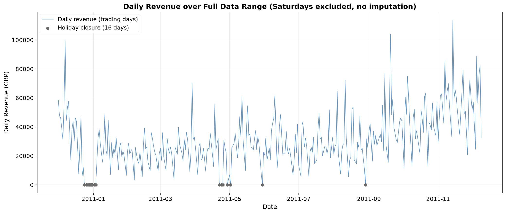
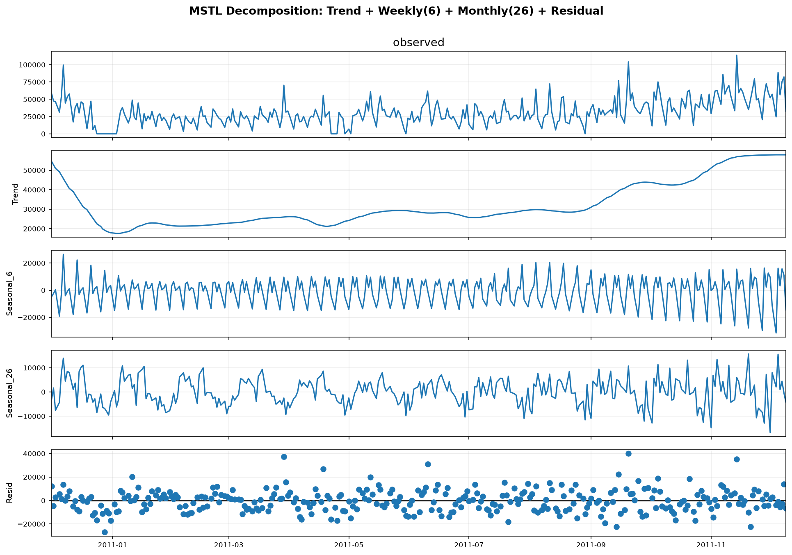
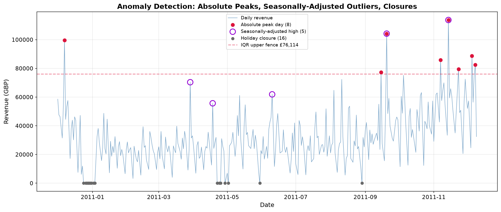
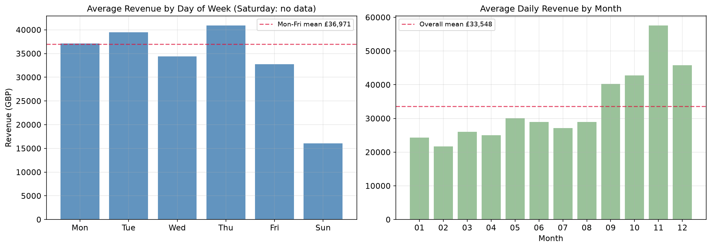
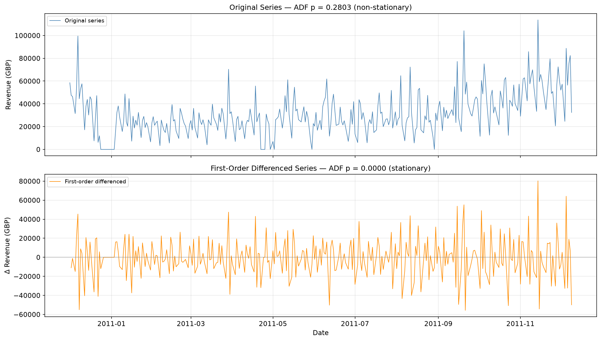
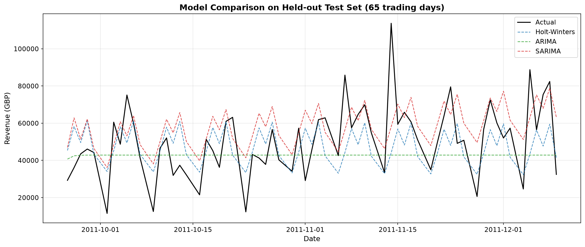
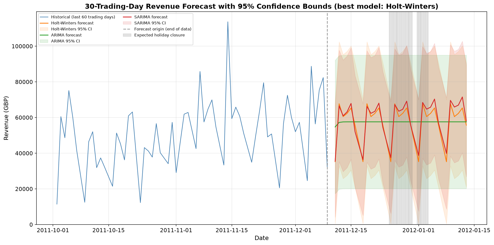

# DSCI 6000 期末项目：在线零售 30 天收入预测分析

## 一、项目背景

本项目是 DSCI 6000 课程的小组期末作业，核心目标是基于 UCI 公开的 Online Retail 零售交易数据集，完整运用时间序列分析全流程方法，完成每日零售收入的建模分析，最终生成未来 30 个交易日的收入预测结果，为库存备货、人员排班等运营决策提供数据支撑。

项目完整覆盖数据预处理、探索性可视化分析、统计平稳性检验、多模型训练对比、定量指标评估、业务策略输出全链路。

- 数据集来源：[UCI Online Retail 数据集](https://archive.ics.uci.edu/dataset/352/online+retail)（id=352）
- 完整代码：`DSCI6000_final.py`，本报告中的所有数字和图表均由该脚本一次运行产出
- 输出目录：图表在 `figs/`，数据表在 `files/`

本项目在预处理阶段发现了两个对结论影响很大的数据质量问题，处理方式在第二节详细说明：

1. **被取消的订单会造成收入虚增**。数据集用 `C` 开头的发票号表示取消，其数量为负。如果按常规做法先过滤掉负数量记录，取消记录就消失了，而对应的原始订单会被保留，导致这笔从未成交的收入被完整计入。数据集里最极端的两笔订单（80,995 件和 74,215 件）都在下单后 15 分钟内被取消，若不处理会成为全序列的最高峰并被误判成"大促高峰"。
2. **全年 53 个周六没有任何记录**，属于结构性数据缺失，不是"当天零交易"。若按 0 填充，会凭空造出 53 个零收入日，进而得出"周六是收入低谷、应安排轮休"这类错误结论。

---

## 二、数据预处理

### 1. 数据集导入与字段说明

我们通过作业指定的 `ucimlrepo` 官方库拉取数据集，同时保留本地 Excel / CSV 加载的备用方案。

需要注意的是，`fetch_ucirepo(id=352)` 返回的 `data.features` 只有 6 列，`InvoiceNo` 和 `StockCode` 被放在 `data.ids` 里，必须一起拼接，否则后续按发票号剔除取消订单时会报 `KeyError`。

本项目重点关注四个核心字段：

| 字段 | 含义 |
| :--- | :--- |
| InvoiceNo | 每笔交易的订单编号，以 `C` 开头表示取消订单 |
| InvoiceDate | 订单生成的具体时间戳 |
| Quantity | 该笔订单中对应商品的购买数量 |
| UnitPrice | 对应商品的单件单价 |

导入后输出数据集总记录数、字段数以及覆盖的时间范围，并打印 UCI 提供的字段说明表（`metadata` / `variables`），确认原始数据加载完整。

### 2. 数据清洗操作与处理理由

清洗步骤的**先后顺序至关重要**，尤其是取消订单这一步必须放在过滤非正数量之前。

**① 删除核心字段缺失记录**

移除 `Quantity`、`UnitPrice`、`InvoiceDate` 为空的记录。这三个字段缺失就无法计算当日收入，保留会直接引入计算错误。本数据集实际删除 0 条（缺失集中在 `CustomerID` 和 `Description`，不影响收入计算）。

**② 剔除取消订单，以及被取消的那张原始订单**

这是本项目对常规清洗流程的关键修正。数据集里 9,288 条 `C` 开头的取消记录数量全为负，如果先过滤 `Quantity > 0`，取消记录会被删掉，而对应的原始正数量订单仍然保留，那笔从未成交的收入就被完整计入了当日营收。两个最极端的例子：

| 原始订单 | 下单时间 | 数量 | 取消单 | 取消时间 | 虚增收入 |
| :--- | :--- | ---: | :--- | :--- | ---: |
| 581483 | 2011-12-09 09:15 | +80,995 | C581484 | 09:27（12 分钟后） | £168,469.60 |
| 541431 | 2011-01-18 10:01 | +74,215 | C541433 | 10:17（16 分钟后） | £77,183.60 |

这两笔恰好会成为全序列最高的两个峰值。若不处理，2011-12-09 的当日收入会显示为 £200,921（实际约 £32,451），2011-01-18 会显示为 £95,978（实际约 £18,794），两者都会被异常检测标为"大促高峰"，而事实上什么都没有卖出去。

配对规则：按 `(客户号, 商品编码, 单价, 数量绝对值)` 四元组匹配，同一组合内按时间先后配对，一张取消单最多抵掉一条原始订单。要求客户号非空——4.1% 的取消单没有客户号，让空值参与匹配可能误删其他客户的真实订单，这里选择宁可少配也不误删（少配的部分约 £27,000，占总收入 0.3%）。

**③ 过滤非正的数量和单价**

上一步之后剩下的负数量记录是库存报废调整（描述字段可见 `printing smudges/thrown away` 之类），单价为 0 的是赠品和样品，两者都不属于正常销售收入。

**④ 计算单笔收入并按日聚合**

按 `Revenue = Quantity × UnitPrice` 计算每条有效交易的收入，再按 `InvoiceDate` 的日期维度分组求和，生成以 datetime 为索引的每日总收入序列。

### 3. 缺失值诊断：结构性缺失与真实停业

日历跨度 374 天，其中只有 305 天有交易记录，69 天完全没有记录。作业要求"处理缺失值（如有）"，前提是先判断缺失的**性质**——这 69 天并不是同一类东西。

**周六：53 个全部缺失，判定为结构性数据缺失**

| 星期 | 日历天数 | 有记录天数 | 原始记录条数 |
| :---: | ---: | ---: | ---: |
| 周一 | 53 | 47 | 95,111 |
| 周二 | 53 | 52 | 101,808 |
| 周三 | 54 | 53 | 94,565 |
| 周四 | 54 | 53 | 103,857 |
| 周五 | 54 | 50 | 82,193 |
| **周六** | **53** | **0** | **0** |
| 周日 | 53 | 50 | 64,375 |

判定依据有三条：

1. 53 个周六**一条记录都没有**，跨越整整 12 个月，无一例外
2. **连取消单也是 0 条**。取消和退货是客服人工操作，理论上任何一天都可能发生
3. **"周末不营业"的解释被周日推翻了**：周日有 50 天记录、64,375 条交易、2,381 张发票，占全部订单的 11.9%

一家在线礼品批发商（商品描述里可见 `Dotcomgiftshop`）周日能出 6 万多条订单而周六一条不出，业务上讲不通，只能是系统未采集或未导出。**把它按 0 填充等于凭空造出 53 个"零收入日"**，会同时污染周季节性、ADF 检验和所有模型，因此本项目直接剔除周六，序列按每周 6 个交易日建模。

**其余 16 天：全部对应英国法定假日，判定为真实停业**

| 缺失日期 | 对应节假日 |
| :--- | :--- |
| 2010-12-24 ~ 2011-01-03（12-24、12-26 ~ 12-31、01-02、01-03） | 圣诞节 + 节礼日 + 新年，连续停业 |
| 2011-04-22 | Good Friday 耶稣受难日 |
| 2011-04-24 | Easter Sunday 复活节 |
| 2011-04-25 | Easter Monday 复活节星期一 |
| 2011-04-29 | 威廉王子婚礼，当年一次性全国公共假日 |
| 2011-05-02 | Early May Bank Holiday |
| 2011-05-30 | Spring Bank Holiday |
| 2011-08-29 | Summer Bank Holiday |

16 天全部能被 2011 年英国法定假日解释，没有一天例外。这类日期门店确实停业、当天确实 0 收入，因此**收入按 0 保留**——它们是数据，不是缺失。这份清单同时也是作业阶段 1 第 4 条要求标记的"节假日"类异常日期。

处理完成后得到 **321 天**（374 个日历日 − 53 个周六）的交易日序列，覆盖 2010-12-01 至 2011-12-09。

### 4. 异常值处理策略：识别并标记，不删除

本项目对异常值采取"识别 + 标记 + 说明"，**不做删除也不做缩尾**，理由有两点：

1. 剔除取消订单后，剩下的高收入日全部落在 9 ~ 12 月 Q4 旺季，是真实的季节性高峰。删掉它们等于抹掉本项目最需要预测的那部分业务规律——预测旺季正是库存备货的核心诉求。
2. 常见的"按 99 分位删除极端值"做法在本数据上会删掉 2010-12-07、2011-09-20、2011-11-14 这类真实旺季高峰日，而虚假的峰值（被取消的订单）其实应该在清洗环节按业务逻辑剔除，而不是靠统计阈值一刀切。

判据选择 **IQR（四分位距）而非 3σ**。3σ 在本序列上的下界是 −£41,704，收入不可能为负，低收入方向的异常永远检测不出来，作业点名要标记的"节假日"类会全部漏掉。

### 5. 数据预处理代码

```python
# ---- 2.2 剔除取消订单，以及被取消的那张原始订单 ----
# 配对规则：按 (客户号, 商品编码, 单价, 数量绝对值) 匹配，同一组合内按时间
# 先后配对，一张取消单最多抵掉一条原始订单。要求客户号非空。
df['_is_cancel'] = df['InvoiceNo'].astype(str).str.startswith('C')
_matchable = df['CustomerID'].notna()
_pair_key = list(zip(
    df['CustomerID'].fillna(-1),
    df['StockCode'].astype(str),
    df['UnitPrice'],
    df['Quantity'].abs(),
))
df['_pair_key'] = _pair_key

_cancels = df[df['_is_cancel'] & _matchable]
_originals = df[~df['_is_cancel'] & _matchable & (df['Quantity'] > 0) & (df['UnitPrice'] > 0)]
_originals = _originals.sort_values('InvoiceDate')

_need = _cancels['_pair_key'].value_counts()                       # 每个组合需要抵掉几条
_rank = _originals.groupby('_pair_key').cumcount()                 # 组合内的时间序号
_limit = _originals['_pair_key'].map(_need).fillna(0).to_numpy()
_matched_idx = _originals.index[_rank.to_numpy() < _limit]

phantom_revenue = (df.loc[_matched_idx, 'Quantity'] * df.loc[_matched_idx, 'UnitPrice']).sum()
df = df.drop(index=_matched_idx)                                   # 删掉被取消的原始订单
df = df[~df['_is_cancel']]                                         # 删掉取消单本身

# ---- 2.3 过滤非正的数量和单价 ----
df = df[(df['Quantity'] > 0) & (df['UnitPrice'] > 0)]

# ---- 2.4 / 2.5 计算收入并按日聚合，补全日历 ----
df['Revenue'] = df['Quantity'] * df['UnitPrice']
daily_raw = df.groupby(df['InvoiceDate'].dt.normalize())['Revenue'].sum().sort_index()
calendar = pd.date_range(daily_raw.index.min(), daily_raw.index.max())
daily_calendar = daily_raw.reindex(calendar)                       # 无记录日先保留为 NaN

# ---- 2.6 缺失日诊断：区分结构性缺失和真实停业 ----
missing_days = daily_calendar[daily_calendar.isna()].index
saturday_missing = missing_days[missing_days.dayofweek == 5]
holiday_missing = missing_days[missing_days.dayofweek != 5]

# ---- 2.7 构建交易日序列：剔除周六，真实停业日填 0 ----
SIX_DAY_WEEK = pd.offsets.CustomBusinessDay(weekmask='Sun Mon Tue Wed Thu Fri')
daily_revenue = daily_calendar[daily_calendar.index.dayofweek != 5].fillna(0)
daily_revenue = daily_revenue.asfreq(SIX_DAY_WEEK)                 # 声明 6 天周频率

# ---- 2.8 异常值识别第一层：绝对高收入日（IQR，不删除） ----
_nonzero = daily_revenue[daily_revenue > 0]
q1, q3 = _nonzero.quantile([0.25, 0.75])
iqr = q3 - q1
upper_fence = q3 + 1.5 * iqr
peak_revenue_days = daily_revenue[daily_revenue > upper_fence]
closure_days = daily_revenue[daily_revenue == 0]
```

### 6. 代码执行结果

```
【2】数据预处理...
  2.1 删除核心字段缺失记录: 0 条
  2.2 剔除取消订单及其原始订单: 12,360 条 (其中配对到的原始订单 3,072 条，剔除虚增收入 £434,534.94)
  2.3 过滤非正 Quantity/UnitPrice: 2,517 条
  2.4 有效交易 527,032 条，收入合计 £10,232,149.60
  2.5 日历跨度 374 天，其中有交易记录 305 天，无记录 69 天
  2.6 缺失日诊断:
      周六: 53/53 个周六无记录 → 判定为结构性数据缺失（下一步剔除）
      非周六: 16 天 → 判定为真实停业（收入按 0 保留）:
          2010-12-24 周五
          2010-12-26 周日
          ...（共 16 天，完整清单见上表）
          2011-08-29 周一
  2.7 交易日序列: 321 天 (2010-12-01 ~ 2011-12-09)，每周 6 个交易日
      每日收入统计: 均值=31,875.86, 标准差=19,147.75, 最大值=113,684.15
  2.8 异常值识别第一层 — 绝对高收入日 (IQR 上界 £76,114.42):
      绝对高收入日 8 天 | 停业日 16 天（真实停业，保留为 0）
      第二层（季节性调整后的异常）在 MSTL 分解完成后识别，见【3.3】
```

数量核对：541,909 − 12,360 − 2,517 = 527,032，其中 12,360 = 9,288 张取消单 + 3,072 条配对到的原始订单。

---

## 三、探索性分析与可视化

### 1. 全量时间范围每日收入趋势



图 1 每日收入趋势折线图（覆盖数据集全部时间跨度，已剔除周六，未做任何插值或缩尾）

图 1 的核心特征：

1. **整体趋势明显上行**。上半年日收入大致在 £20,000 ~ £40,000 波动，9 月之后台阶式抬升，11 月出现全年最密集的高峰，符合零售行业 Q4 旺季规律。
2. **周期性脉冲清晰**。序列呈规律的锯齿状，谷底基本都落在周日（周日日均只有工作日的 43.5%），这是最主要的短周期波动来源。
3. **峰值真实可信**。全年最高为 2011-11-14 的 £113,684，最高的 8 天全部落在 9 ~ 12 月。清洗阶段剔除虚增收入之后，序列里不再有由取消订单造成的假峰值。
4. **停业日以灰点单独标出**。2010-12-24 到 2011-01-03 是一段连续的圣诞新年停业，其余散落的灰点是复活节、银行假日等，共 16 天。

### 2. 时间序列分解

我们使用 `statsmodels.tsa.seasonal.MSTL` 做多重季节性分解，一次拆出作业要求的四个成分。周期以**交易日**为单位：周季节性 6（一周 6 个交易日），月季节性 26（30 个日历日 × 6/7 ≈ 26 个交易日）。



图 2 MSTL 分解图：Trend + Weekly(6) + Monthly(26) + Residual

分解得到的振幅：**周季节性 £58,012，月季节性 £32,444**。周季节性的振幅接近月季节性的两倍，说明本业务的收入波动主要由周内节奏驱动，月内节奏是次要因素。

### 3. 分解要素对应的零售规律解读

1. **长期趋势（Trend）**：反映业务的整体增长走向。本序列的趋势项从年初的约 £20,000 抬升到年末的约 £50,000，说明这一年业务整体处于扩张状态，且增长集中在下半年。
2. **周季节性（Weekly）**：明确一周之内的高峰与低谷。本数据的实测结果是周四、周二最高，周日最低（详见本节第 5 小节），与"周末销售高于工作日"的零售直觉相反——这是一家面向批发客户的商家，订单节奏跟随企业采购的工作日周期，而不是消费者的周末逛店习惯。
3. **月季节性（Monthly）**：捕捉一个月内的收入起伏，振幅约为周季节性的一半，说明月内节奏对备货计划的影响弱于周内节奏。
4. **随机噪声（Residual）**：剥离趋势与两层季节性之后的剩余波动。这一项正是下一小节识别"真异常"的依据——能被趋势和季节性解释的高低起伏不算异常，残差里的极端值才算。

### 4. 异常日期标记：三个类型

作业要求"标记收入异常的异常值日期（如有、节假日、销售活动）"。我们分三类输出，避免把"生意大"和"异常"混为一谈。

**类型一 · 绝对高收入日（IQR 上界 £76,114.42，共 8 天）**

回答"哪几天生意最大"，是备货规划直接关心的日子。

| 日期 | 星期 | 收入 |
| :--- | :---: | ---: |
| 2011-11-14 | 周一 | £113,684.15 |
| 2011-09-20 | 周二 | £104,183.02 |
| 2010-12-07 | 周二 | £99,515.15 |
| 2011-12-05 | 周一 | £88,741.96 |
| 2011-11-07 | 周一 | £85,832.94 |
| 2011-12-08 | 周四 | £82,397.15 |
| 2011-11-23 | 周三 | £79,511.98 |
| 2011-09-15 | 周四 | £77,194.83 |

8 天全部落在 9 ~ 12 月，且集中在周一至周四，与 Q4 旺季 + 工作日采购的规律完全一致。

**类型二 · 季节性调整后的异常（MSTL 残差 IQR，上界 23,163 / 下界 −25,073）**

类型一里的大部分日期可以用趋势和 Q4 旺季解释，并不算"异常"。真正的异常要看剔除趋势、周季节性、月季节性之后的残差。残差以 0 为中心，IQR 上下界天然对称，**低收入方向也能被检出**，不再有 3σ 下界为负导致单边失效的问题。

| 日期 | 星期 | 收入 | 高出季节性预期 |
| :--- | :---: | ---: | ---: |
| 2011-11-14 | 周一 | £113,684.15 | £35,249 |
| 2011-09-20 | 周二 | £104,183.02 | £39,971 |
| 2011-03-29 | 周二 | £70,333.17 | £37,211 |
| 2011-06-10 | 周五 | £61,872.49 | £31,085 |
| 2011-04-18 | 周一 | £55,648.33 | £26,852 |

偏低方向：**0 天**。这是一个结论而不是检测失效——除停业日之外，没有无法用季节性解释的低收入日。数据集不含促销日历，因此上面这 5 天的具体成因无法从数据本身确认，最可能对应促销活动或偶发大额订单。值得注意的是 2011-03-29 和 2011-06-10 并不在类型一的名单里：它们的绝对收入不算最高，但相对于自身所处的淡季水平，抬升幅度反而更突出。

**类型三 · 节假日停业（16 天）**

完整清单见第二节第 3 小节的表格，全部对应英国法定假日，收入为 0。



图 3 异常检测图：红点为绝对高收入日，紫圈为季节性调整后偏高日，灰点为停业日

三类异常共 29 条记录（含重叠标注）已导出到 `files/anomaly_dates.csv`。

### 5. 周度与月度季节性模式

下面的统计**只使用真实交易日**，不含被剔除的周六，因此不会被结构性缺失污染。



图 7 左：周内平均收入；右：各月日均收入

| 星期 | 交易日数 | 日均收入 | 占工作日均值 |
| :---: | ---: | ---: | ---: |
| 周四 | 53 | £40,919 | 110.7% |
| 周二 | 52 | £39,476 | 106.8% |
| 周一 | 47 | £37,145 | 100.5% |
| 周三 | 53 | £34,420 | 93.1% |
| 周五 | 50 | £32,724 | 88.5% |
| 周日 | 50 | £16,089 | 43.5% |
| 周六 | 0 | 无数据 | — |

工作日（周一至周五）均值 £36,971，全序列均值 £33,548。

月度层面呈现典型的 Q4 旺季结构：**11 月最高（日均 £57,579），2 月最低（日均 £21,652）**，两者相差 2.7 倍。9 月起连续四个月高于全年均值，这一段是备货和人力资源的重点投入期。

### 6. 探索性分析代码

```python
# ---- 3.2 MSTL 双周期分解 ----
mstl_result = MSTL(
    endog=daily_revenue,
    periods=[DAYS_PER_WEEK, DAYS_PER_MONTH],   # 周期以交易日计：6 和 26
    iterate=2,                                 # 迭代 2 轮，逐层剥离多重周期
    lmbda=None,                                # 加法模型，不做 Box-Cox 变换
).fit()

# ---- 3.3 异常检测第二层：季节性调整后的残差 ----
# 残差以 0 为中心，IQR 上下界天然对称，低收入方向也能被检出
_resid = mstl_result.resid
rq1, rq3 = _resid.quantile([0.25, 0.75])
riqr = rq3 - rq1
resid_upper, resid_lower = rq3 + 1.5 * riqr, rq1 - 1.5 * riqr
# 停业日的残差必然极端，但它是已知的日历事件而非异常，单列一类不重复计入
_open_days = _resid[daily_revenue > 0]
resid_high = _open_days[_open_days > resid_upper]
resid_low = _open_days[_open_days < resid_lower]

# ---- 3.4 周 / 月季节性：只用真实交易日 ----
trading = daily_revenue[daily_revenue > 0]
weekly_pattern = trading.groupby(trading.index.dayofweek).mean()
monthly_pattern = trading.groupby(trading.index.month).mean()
weekday_mean = trading[trading.index.dayofweek < 5].mean()
```

### 7. 代码执行结果

```
【3】探索性分析与可视化...
  ✓ 已保存全量收入趋势图: 01_daily_revenue_full.png
  正在进行 MSTL 双周期分解...
  ✓ 已保存序列分解图: 02_decomposition.png（成分: trend, seasonal_6, seasonal_26, resid）
      周季节性振幅 £58,012，月季节性振幅 £32,444

  异常检测第二层 — 季节性调整后残差 (IQR 上界 23,163 / 下界 -25,073，上下界对称):
      偏高异常 5 天 | 偏低异常 0 天

  【类型一】绝对高收入日 (> £76,114.42)，共 8 天:
    2010-12-07 周二: £   99,515.15
    2011-09-15 周四: £   77,194.83
    2011-09-20 周二: £  104,183.02
    2011-11-07 周一: £   85,832.94
    2011-11-14 周一: £  113,684.15
    2011-11-23 周三: £   79,511.98
    2011-12-05 周一: £   88,741.96
    2011-12-08 周四: £   82,397.15

  【类型二】季节调整后偏高，共 5 天（无法用趋势/周/月规律解释）:
    2011-03-29 周二: £   70,333.17  （高出季节性预期 £37,211）
    2011-04-18 周一: £   55,648.33  （高出季节性预期 £26,852）
    2011-06-10 周五: £   61,872.49  （高出季节性预期 £31,085）
    2011-09-20 周二: £  104,183.02  （高出季节性预期 £39,971）
    2011-11-14 周一: £  113,684.15  （高出季节性预期 £35,249）

  【类型二】季节调整后偏低，共 0 天:
    无 — 除停业日外，没有无法用季节性解释的低收入日

  【类型三】节假日停业，共 16 天（收入为 0，见【2.6】清单）

  ✓ 三类异常日期清单已保存至: anomaly_dates.csv（共 29 条）

  周内收入模式（仅真实交易日）:
    周四: £40,919  （工作日均值的 110.7%）
    周二: £39,476  （工作日均值的 106.8%）
    周一: £37,145  （工作日均值的 100.5%）
    周三: £34,420  （工作日均值的 93.1%）
    周五: £32,724  （工作日均值的 88.5%）
    周日: £16,089  （工作日均值的 43.5%）
```

---

## 四、平稳性检验

### 1. ADF 检验结果

对清洗完成的交易日收入序列执行 Augmented Dickey-Fuller 检验：

| 指标 | 原始序列 | 一阶差分后 |
| :--- | ---: | ---: |
| ADF 统计量 | −2.0143 | −6.4859 |
| p 值 | 0.2803 | 0.0000 |
| 5% 临界值 | −2.8710 | −2.8710 |

### 2. 检验结论解读

原假设 H₀：序列存在单位根，属于非平稳序列；备择假设 H₁：序列不存在单位根，属于平稳序列。

原始序列的 p 值为 **0.2803**，远大于 0.05 的显著性水平，因此在 5% 显著性水平下**未能拒绝原假设**，判定当前序列不平稳。ADF 统计量 −2.0143 也没有超过 5% 临界值 −2.8710（更负才算通过）。

这里需要注意统计表述的严谨性：ADF 检验的结论只能是"拒绝"或"未能拒绝"原假设，**不能说"接受原假设"**——检验没有提供足够证据推翻单位根的存在，并不等于证明了单位根一定存在。

序列不平稳符合预期：图 1 已经显示出明显的上行趋势，而趋势本身就是非平稳的典型来源。

### 3. 差分变换

按作业要求，序列不平稳时应用差分变换。一阶差分后 ADF 统计量降到 **−6.4859**，p 值 **< 0.0001**，远小于 0.05，可以在 1% 显著性水平下拒绝原假设，序列达到平稳，满足时间序列模型的建模输入要求。



图 4 差分前后对比图（上：原始序列，ADF p = 0.2803；下：一阶差分序列，ADF p < 0.0001）

图 4 直观展示了差分的效果。上图的原始序列中心水平随时间抬升，方差也在扩大；下图差分后序列围绕 0 上下震荡，没有可见的趋势成分，均值回复特征明显。差分序列的波幅在年末略有放大，反映旺季的绝对波动量本身更大，但这不影响 ADF 的平稳性判定。

需要说明的是，`diff_series` 本身只用于平稳性检验和绘图；**后续 ARIMA / SARIMA 通过 `d=1` 参数在模型内部完成这一差分**，两者等价，因此不需要把差分后的序列单独喂给模型。

### 4. 平稳性检验代码

```python
def adf_report(series):
    """对序列做 ADF 检验，返回统计量、p 值和 5% 临界值。"""
    stat, pval, _usedlag, _nobs, crit, _icbest = adfuller(series.dropna(), autolag='AIC')
    return {'series': series.name, 'ADF stat': stat, 'p-value': pval, '5% critical': crit['5%']}


# ---- 4.1 原始序列 ----
adf_result = adf_report(daily_revenue)

# 判断依据是 p 值，不是临界值。原假设 H0：序列存在单位根（非平稳）
is_stationary = adf_result['p-value'] < 0.05
if is_stationary:
    print("  ✓ 结论: p-value < 0.05，拒绝原假设，序列平稳")
else:
    print("  ⚠ 结论: p-value >= 0.05，未能拒绝原假设，序列非平稳，需要差分")

# ---- 4.2 一阶差分并复检 ----
diff_series = daily_revenue.diff().dropna()
adf_diff_result = adf_report(diff_series)
if adf_diff_result['p-value'] < 0.05:
    print("  ✓ 结论: p-value < 0.05，一阶差分后序列平稳，满足建模要求")
else:
    print("  ⚠ 结论: 一阶差分后仍未通过平稳性检验，需要考虑更高阶差分")
```

### 5. 代码执行结果

```
【4】平稳性检验...
  序列: daily revenue
  ADF Statistic: -2.0143
  p-value: 0.2803
  5% critical: -2.8710
  ⚠ 结论: p-value >= 0.05，未能拒绝原假设，序列非平稳，需要差分

  一阶差分后 ADF 检验:
  序列: daily revenue (1st diff)
  ADF Statistic: -6.4859
  p-value: 0.0000
  5% critical: -2.8710
  ✓ 结论: p-value < 0.05，一阶差分后序列平稳，满足建模要求
  → 后续 ARIMA/SARIMA 通过 d=1 在模型内部完成这一差分
```

---

## 五、模型训练与 30 步预测

### 1. 数据集划分规则

严格按时间顺序划分：前 80% 作为训练集，时间上靠后的 20% 作为留出测试集，**全程没有随机切分**，符合时间序列数据的划分规范，避免用未来信息预测过去造成的数据泄露。

| | 时间范围 | 天数 | 占比 |
| :--- | :--- | ---: | ---: |
| 训练集 | 2010-12-01 ~ 2011-09-25 | 256 | 79.8% |
| 测试集 | 2011-09-26 ~ 2011-12-09 | 65 | 20.2% |

### 2. 三类模型与周期设定

作业要求至少 1 个模型，我们训练了三个以便横向比较。三者的季节性周期统一设为 **6 个交易日**（本数据集不含周六）：

1. **Holt-Winters 指数平滑**：加性趋势 + 加性周季节性。通过水平项、趋势项、季节项三个平滑系数完成拟合，训练极快，对规律稳定的日常零售数据表现稳健。
2. **ARIMA(1,1,1)**：自回归差分移动平均模型，适配单变量平稳序列，能捕捉自相关特征，但**不含季节项**，在本项目中作为对照基准，用来量化"加入季节性到底带来多少提升"。
3. **SARIMA(1,1,1)(1,1,1,6)**：在 ARIMA 基础上增加季节性自回归、季节性差分、季节性移动平均，可同时适配 6 个交易日的周季节性和长期趋势。

训练集上的 AIC：Holt-Winters 4,855.2、SARIMA 5,458.9、ARIMA 5,637.1。SARIMA 明显优于 ARIMA，印证了周季节性是本序列的主要结构。

### 3. 测试集预测对比



图 5 三个模型在留出测试集（65 个交易日）上的多步预测对比

图 5 可以清楚看到三者的差异：ARIMA 的预测在几步之后就收敛成一条水平线（绿色），完全无法跟随周内起伏——这正是缺少季节项的直接后果；Holt-Winters（蓝色）和 SARIMA（红色）都复现了锯齿状的周节奏，谷底与实际值的周日低谷基本对齐。三者共同的不足是对 11 月的几个高峰明显低估，原因是训练集截止 2011-09-25，模型没有见过 Q4 旺季的爆发力度。

### 4. 未来 30 步预测：为什么必须在全序列上重新拟合

这一步有个容易踩的坑：评估阶段的模型只见过前 80% 的数据，直接拿它调用 `forecast(30)`，得到的是"**训练集末尾之后的 30 步**"，即 2011-09-26 ~ 2011-10-25，落在测试集区间内，根本不是未来。如果此时把预测结果的索引改写成未来日期，就会得到一份日期与数值完全不对应的预测表。

因此本项目在评估结束后，**用完整的 321 天序列重新拟合三个模型**，预测起点才是数据的真实末端。

预测区间：**2011-12-11 ~ 2012-01-13，共 30 个交易日**。由于序列按每周 6 个交易日构建，30 个交易日跨越 35 个日历日。

**预计停业日：9 天**

预测窗口正好覆盖圣诞新年档，而单变量模型学不到"圣诞节关门"这种日历事件，会照常给出正常收入预测。我们按两个来源标出预计停业日：

- **上一年同期实际停业 7 天**（依据 2010 年的实测停业记录按月-日匹配）：2011-12-26、12-27、12-28、12-29、12-30、2012-01-02、01-03
- **日历补充 2 天**：2011-12-25（圣诞节）、2012-01-01（元旦）。这两天无法从上一年数据推断出来——2010-12-25 和 2011-01-01 恰好都是周六，本来就不在交易日序列里



图 6 30 个交易日预测与 95% 置信区间（灰色竖条为预计停业日）

图 6 中三个模型的预测都延续了历史的周内节奏，没有出现异常跳变；ARIMA 依旧退化成水平线。灰色竖条标出的停业日上，模型仍然给出了正常的收入预测（例如 2011-12-25 预测 £35,251），这部分必须由运营侧强制覆盖为 0。

### 5. 置信区间的口径与校准

三个模型的置信区间必须口径一致才能比较。这里有两个技术问题：

- Holt-Winters 没有解析置信区间
- ARIMA / SARIMA 的解析区间假设预测误差随步长按 √h 发散

我们实测了后一个假设是否成立：把测试集的 65 步按顺序分成 5 段，Holt-Winters 各段 RMSE 依次为 15,123 / 14,238 / 16,683 / 22,703 / 18,777。**误差并没有随步长明显增长**，因此 √h 型的解析区间会严重过宽（实测平均宽度 £181,742，下界大面积跌到负数，覆盖率 100%，等于失去判别力）。

因此三个模型统一改用**留出测试集的实际预测误差标准差**构造区间：点预测 ± 1.96 × σ_test，并用它在测试集上的实际覆盖率作为校准证据：

| 模型 | σ_test | 测试集实际覆盖率（目标 95%） |
| :--- | ---: | ---: |
| Holt-Winters | £17,728.27 | 95.4% |
| ARIMA | £19,088.56 | 93.8% |
| SARIMA | £15,949.50 | 96.9% |

三者的覆盖率都落在 95% 附近，说明这个口径是经过校准的。此外，收入不可能为负，所有区间下界统一截断到 0。

### 6. 模型训练与预测代码

```python
def fit_models(endog, label):
    """在给定序列上拟合三个模型，返回 {模型名: 已拟合对象}。"""
    fitted = {}
    # Holt-Winters：加性趋势 + 加性周季节性，周期为 6 个交易日
    fitted['Holt-Winters'] = ExponentialSmoothing(
        endog, trend='add', seasonal='add', seasonal_periods=DAYS_PER_WEEK,
    ).fit()
    # ARIMA(1,1,1)：单变量自相关模型，不含季节项，作为对照基准
    fitted['ARIMA'] = ARIMA(endog, order=(1, 1, 1)).fit()
    # SARIMA(1,1,1)(1,1,1,6)：在 ARIMA 基础上增加 6 个交易日的季节项
    fitted['SARIMA'] = SARIMAX(
        endog, order=(1, 1, 1), seasonal_order=(1, 1, 1, DAYS_PER_WEEK),
    ).fit(disp=False)
    return fitted


# ---- 5.1 按时间顺序划分（不打乱） ----
split_point = int(len(daily_revenue) * TRAIN_RATIO)
train = daily_revenue.iloc[:split_point]
test = daily_revenue.iloc[split_point:]

train_models = fit_models(train, '训练集')
test_predictions = {
    name: pd.Series(np.asarray(model.forecast(steps=len(test))), index=test.index)
    for name, model in train_models.items()
}

# ---- 7. 未来 30 步：必须在全序列上重新拟合 ----
# 评估阶段的模型只见过前 80% 的数据，直接用它预测会得到"训练集末尾之后的
# 30 步"，落在测试集区间内，不是真正的未来。
full_models = fit_models(daily_revenue, '全序列')

forecast_dates = pd.date_range(
    start=daily_revenue.index[-1] + SIX_DAY_WEEK,
    periods=FORECAST_STEPS,
    freq=SIX_DAY_WEEK,
)


def forecast_with_ci(model, name, steps):
    """生成点预测和 95% 置信区间。

    区间口径：点预测 ± 1.96 × σ_test，其中 σ_test 是该模型在留出测试集上的
    预测误差标准差（见【6】的覆盖率校准）。三个模型统一用这个口径，彼此可比。
    收入不可能为负，下界统一截断到 0。
    """
    mean = np.asarray(model.forecast(steps=steps))
    margin = 1.96 * error_sigma[name]
    return pd.DataFrame({
        'Date': forecast_dates.strftime('%Y-%m-%d'),
        'Weekday': [_dow_cn[d.dayofweek] for d in forecast_dates],
        'Predicted_Revenue': np.round(mean, 2),
        'Lower_Bound_95CI': np.round(np.clip(mean - margin, 0, None), 2),
        'Upper_Bound_95CI': np.round(mean + margin, 2),
    }, index=forecast_dates)
```

### 7. 代码执行结果

```
【5】模型训练...
  训练集: 2010-12-01 至 2011-09-25 (256 天, 79.8%)
  测试集: 2011-09-26 至 2011-12-09 (65 天, 20.2%)
  在训练集上拟合模型...
    ✓ Holt-Winters  拟合完成 (AIC=4,855.2)
    ✓ ARIMA         拟合完成 (AIC=5,637.1)
    ✓ SARIMA        拟合完成 (AIC=5,458.9)

【7】生成未来 30 个交易日的预测...
  在全序列上拟合模型...
    ✓ Holt-Winters  拟合完成 (AIC=6,117.4)
    ✓ ARIMA         拟合完成 (AIC=7,108.8)
    ✓ SARIMA        拟合完成 (AIC=6,919.7)
  预测区间: 2011-12-11 至 2012-01-13 （30 个交易日，跨 35 个日历日）
  预计停业日合计 9 天:
    · 上一年同期实际停业 7 天: 2011-12-26、2011-12-27、2011-12-28、2011-12-29、2011-12-30、2012-01-02、2012-01-03
    · 日历补充 2 天（圣诞节/元旦当天，上一年该日期为周六故无记录）: 2011-12-25、2012-01-01
```

最优模型 Holt-Winters 的 30 步预测表（完整表格见 `files/forecast_30days_holtwinters.csv`，三个模型各一份）：

| Date | Weekday | Predicted_Revenue | Lower_95CI | Upper_95CI | 预计停业 |
| :--- | :---: | ---: | ---: | ---: | :---: |
| 2011-12-11 | 周日 | 35,260.49 | 513.08 | 70,007.89 | |
| 2011-12-12 | 周一 | 67,738.13 | 32,990.73 | 102,485.53 | |
| 2011-12-13 | 周二 | 60,538.26 | 25,790.86 | 95,285.66 | |
| 2011-12-14 | 周三 | 62,341.43 | 27,594.03 | 97,088.83 | |
| 2011-12-15 | 周四 | 65,394.26 | 30,646.86 | 100,141.66 | |
| 2011-12-16 | 周五 | 55,748.51 | 21,001.11 | 90,495.92 | |
| 2011-12-18 | 周日 | 35,255.73 | 508.32 | 70,003.13 | |
| 2011-12-19 | 周一 | 67,733.37 | 32,985.97 | 102,480.77 | |
| 2011-12-20 | 周二 | 60,533.50 | 25,786.09 | 95,280.90 | |
| 2011-12-21 | 周三 | 62,336.67 | 27,589.27 | 97,084.07 | |
| 2011-12-22 | 周四 | 65,389.50 | 30,642.09 | 100,136.90 | |
| 2011-12-23 | 周五 | 55,743.75 | 20,996.35 | 90,491.15 | |
| 2011-12-25 | 周日 | 35,250.96 | 503.56 | 69,998.37 | **是** |
| 2011-12-26 | 周一 | 67,728.61 | 32,981.20 | 102,476.01 | **是** |
| 2011-12-27 | 周二 | 60,528.73 | 25,781.33 | 95,276.14 | **是** |
| 2011-12-28 | 周三 | 62,331.91 | 27,584.50 | 97,079.31 | **是** |
| 2011-12-29 | 周四 | 65,384.73 | 30,637.33 | 100,132.14 | **是** |
| 2011-12-30 | 周五 | 55,738.99 | 20,991.58 | 90,486.39 | **是** |
| 2012-01-01 | 周日 | 35,246.20 | 498.80 | 69,993.60 | **是** |
| 2012-01-02 | 周一 | 67,723.84 | 32,976.44 | 102,471.25 | **是** |
| 2012-01-03 | 周二 | 60,523.97 | 25,776.57 | 95,271.37 | **是** |
| 2012-01-04 | 周三 | 62,327.14 | 27,579.74 | 97,074.55 | |
| 2012-01-05 | 周四 | 65,379.97 | 30,632.57 | 100,127.37 | |
| 2012-01-06 | 周五 | 55,734.22 | 20,986.82 | 90,481.63 | |
| 2012-01-08 | 周日 | 35,241.44 | 494.03 | 69,988.84 | |
| 2012-01-09 | 周一 | 67,719.08 | 32,971.68 | 102,466.48 | |
| 2012-01-10 | 周二 | 60,519.21 | 25,771.80 | 95,266.61 | |
| 2012-01-11 | 周三 | 62,322.38 | 27,574.98 | 97,069.78 | |
| 2012-01-12 | 周四 | 65,375.21 | 30,627.81 | 100,122.61 | |
| 2012-01-13 | 周五 | 55,729.46 | 20,982.06 | 90,476.86 | |

---

## 六、模型评估

### 1. 测试集定量指标

使用留出的 20% 测试集（65 个交易日）做多步预测，对三个模型分别计算三类指标：

| 模型 | MSE（均方误差） | RMSE（均方根误差） | MAE（平均绝对误差） |
| :--- | ---: | ---: | ---: |
| **Holt-Winters** | **315,550,566.34** | **17,763.74** | **13,069.73** |
| SARIMA | 320,631,123.45 | 17,906.18 | 14,494.33 |
| ARIMA | 416,708,001.62 | 20,413.43 | 15,809.06 |

### 2. 指标含义

1. **MSE** 衡量预测值与真实值误差的平方平均值，放大了大误差的权重，能敏感捕捉偏离特别远的极端错误。
2. **RMSE** 是 MSE 开平方的结果，单位与原始收入的货币单位一致，直接反映平均偏差量级。
3. **MAE** 是绝对误差的平均值，代表平均意义上预测值与真实值相差的金额，不受平方放大影响，更贴近运营人员对误差的直观感知。

### 3. 模型选择与适用性

**Holt-Winters 在三个指标上全部最优**，因此选为最终预测模型。但需要如实说明：它对 SARIMA 的领先幅度很小（RMSE 相差 142，约 0.8%），在统计上基本属于并列，不宜据此断言 Holt-Winters 在结构上更适合本问题。

三个模型的表现差异中，真正显著的是 **ARIMA 明显落后**（RMSE 高出约 15%）。原因很明确：ARIMA(1,1,1) 不含季节项，几步之后预测就收敛成水平线（见图 5），完全无法跟随周内节奏。这从反面证明了周季节性是本序列最重要的可预测结构——这一点与第三节 MSTL 分解的结论一致（周季节性振幅 £58,012，接近月季节性的两倍）。

- **优势**：Holt-Winters 参数少、拟合快，对趋势和周季节性的捕捉稳定，AIC 在三者中最低（训练集 4,855.2），预测结果贴合历史波动规律，未出现脱离业务常识的跳变。
- **劣势**：没有解析置信区间（本项目改用留出集误差校准，见第五节第 5 小节）；趋势项接近 0，导致 30 步预测退化为固定周模式逐周重复，无法预判圣诞后回落和 1 月淡季。
- **适用性**：适合当前这种"趋势平缓 + 周节奏强 + 无外部变量"的日收入短期预测。若后续需要纳入促销日历、节假日、天气等外生变量，应改用 SARIMAX（带 `exog`）。

### 4. 模型评估代码

```python
def evaluate_model(y_true, y_pred, model_name):
    """计算并打印 MSE / RMSE / MAE 三个定量指标。"""
    mse = mean_squared_error(y_true, y_pred)
    rmse = float(np.sqrt(mse))
    mae = mean_absolute_error(y_true, y_pred)
    return {'Model': model_name, 'MSE': mse, 'RMSE': rmse, 'MAE': mae}


metrics = pd.DataFrame([evaluate_model(test, test_predictions[n], n) for n in train_models])

# ---- 用留出测试集的实际预测误差校准 95% 置信区间 ----
error_sigma = {}
for name in train_models:
    err = np.asarray(test) - np.asarray(test_predictions[name])
    sigma = float(err.std(ddof=1))
    lower = np.clip(np.asarray(test_predictions[name]) - 1.96 * sigma, 0, None)
    upper = np.asarray(test_predictions[name]) + 1.96 * sigma
    coverage = float(((np.asarray(test) >= lower) & (np.asarray(test) <= upper)).mean())
    error_sigma[name] = sigma

# 以测试集 RMSE 最小者为最优模型，后续预测与业务建议全部由它驱动
best_model_name = metrics.loc[metrics['RMSE'].idxmin(), 'Model']
```

### 5. 代码执行结果

```
【6】模型评估...
  Holt-Winters   MSE:   315,550,566.34   RMSE:  17,763.74   MAE:  13,069.73
  ARIMA          MSE:   416,708,001.62   RMSE:  20,413.43   MAE:  15,809.06
  SARIMA         MSE:   320,631,123.45   RMSE:  17,906.18   MAE:  14,494.33

  95% 置信区间校准（基于留出测试集的实际预测误差）:
    Holt-Winters  σ_test = £17,728.27   测试集实际覆盖率 95.4% (目标 95%)
    ARIMA         σ_test = £19,088.56   测试集实际覆盖率 93.8% (目标 95%)
    SARIMA        σ_test = £15,949.50   测试集实际覆盖率 96.9% (目标 95%)

  ✓ 最优模型: Holt-Winters (测试集 RMSE = 17,763.74，三者中最小)
```

---

## 七、业务战略建议

### 1. 核心季节性规律

**周内规律**（仅统计真实交易日，工作日均值 £36,971）：

- **高峰日：周四（£40,919，110.7%）、周二（£39,476，106.8%）**，两天合计高出工作日均值约 9%
- **低谷日：周日（£16,089，仅为工作日均值的 43.5%）**
- **周六不参与比较**：全年 53 个周六无任何记录，属于数据采集缺失，已在预处理阶段剔除。这一点必须明确写出——若把周六按 0 计入，会得出"周六是全周最低谷"的错误结论并据此安排轮休

值得强调的是，本业务的周内规律与"周末销售高于工作日"的零售常识相反。这是一家面向批发客户的商家，订单节奏跟随企业采购的工作日周期。

**月度规律**：11 月最高（日均 £57,579），2 月最低（日均 £21,652），相差 2.7 倍。9 月起连续四个月高于全年均值 £33,548，是备货与人力的重点投入期。

### 2. 预测期关键节点

预测期 30 个交易日中，剔除 9 个预计停业日后有 **21 个营业日**，预测总收入 **£1,224,362**，日均 **£58,303**。阈值全部由预测表的分位数计算得出，不是预设的固定数值。

| 类型 | 阈值 | 天数 | 代表日期与预测收入 |
| :--- | :--- | :---: | :--- |
| 收入高峰日 | ≥ £65,380（75 分位） | 6 | 2011-12-12 周一（£67,738）、2011-12-19 周一（£67,733）、2012-01-09 周一（£67,719）、2011-12-15 周四（£65,394）、2011-12-22 周四（£65,390） |
| 收入低谷日 | ≤ £55,744（25 分位） | 6 | 2012-01-08 周日（£35,241）、2011-12-18 周日（£35,256）、2011-12-11 周日（£35,260）、2012-01-13 周五（£55,729）、2012-01-06 周五（£55,734） |
| 高不确定日 | 相对不确定性 ≥ 125% | 7 | 全部为周五和周日 |
| 预计停业日 | — | 9 | 2011-12-25 ~ 12-30、2012-01-01 ~ 01-03 |

关于"高不确定日"：由于置信区间是常宽的（£69,495），按绝对宽度筛选没有区分度，因此改用**相对不确定性 = 区间宽度 ÷ 预测值**。周日预测值只有 £35,260 而区间同宽，相对不确定性高达 197%；周一是 103%。这说明**低收入日的预测误差占比更高，备货风险实际更大**，这是绝对宽度看不出来的信息。

### 3. 库存备货建议

1. **整体预算**：预测期 21 个营业日总收入 £1,224,362，日均 £58,303，按此规模安排备货预算。
2. **高峰日**：6 个高峰日（收入 ≥ £65,380）提前 7 天完成热销商品备货，备货量按当日预测值 ×1.2 准备，合计 **£479,225**。
3. **低谷日**：6 个低谷日（收入 ≤ £55,744）压缩库存至 2 天周转量，减少低峰期的资金占用。
4. **高不确定日**：7 个高不确定日（相对不确定性 ≥ 125%，即周五和周日）按预测值下限备货，避免在预测最不可靠的日子压库存。
5. **停业日**：9 个预计停业日不备货；**停业前最后一个营业日（2011-12-23 周五）按 ×1.2 备货**，承接节前集中采购需求。

⚠ **重要提醒**：模型对停业日仍会给出正常收入预测（例如 2011-12-25 圣诞节预测 £35,251），这是单变量模型学不到日历事件所致，必须由运营侧强制覆盖为 0。直接照搬模型输出会把近三成的备货资源压在关门的日子上。

### 4. 人员排班建议

1. **周四、周二**为周内高峰，较工作日均值高约 9%，按比例增配订单处理与客服人手。
2. **周日**收入仅为工作日均值的 43.5%，安排员工错峰轮休，降低非高峰时段的人力成本。
3. 预测期内 **6 个高峰日**额外配置 2-3 名机动备岗，应对临时订单量上涨。
4. **11 月为年度旺季**（日均 £57,579，约为 2 月的 2.7 倍），需提前锁定临时人力。
5. 9 个预计停业日按节假日排班，停业前一个营业日增配人手处理节前订单。

### 5. 模型局限与后续改进方向

1. **学不到日历事件**：9 个预计停业日模型仍给出正常收入预测，必须人工覆盖。改进方向是把节假日做成外生变量（SARIMAX 的 `exog`）。
2. **无法纳入外部因素**：第三节类型二里那 5 个"季节调整后偏高"日很可能就是促销活动，但数据集不含促销日历，模型只能把它们当噪声处理。加入促销、天气、竞品等特征是最直接的提升路径。
3. **趋势项接近 0**：Holt-Winters 的 30 步预测退化为固定周模式逐周重复，无法预判圣诞后回落和 1 月淡季（历史上 2 月是全年低谷，日均 £21,652）。
4. **置信区间为常宽**（£69,495）。实测本序列误差不随步长发散，故常宽在覆盖率上成立（95.4%），但它也就无法体现远期本应更高的不确定性。
5. **数据仅覆盖约 1 年**（2010-12-01 ~ 2011-12-09），只包含一个 Q4 旺季，年度季节性无法交叉验证。
6. **周六缺失是采集问题**而非零交易，本项目按剔除处理。若数据方能补齐，可还原完整的 7 天周内规律。
7. **评估口径偏严**：使用的是一次性 65 步静态预测。实际运营应改为滚动预测（每日更新数据、只预测未来数天），误差会显著低于本报告。
8. **末端数据不完整**：数据集最后一天 2011-12-09 记录截止 12:50，作为预测起点可能略微低估水平。

### 6. 业务建议代码

```python
# ---- 8.2 预测期关键节点：全部从预测表实际计算 ----
# 先剔除预计停业日再排序。模型给圣诞节也预测了正常收入，直接拿去排名会把
# 备货资源压在关门的日子上。
operating = best_forecast[best_forecast['Expected_Closure'] != '']
operating = best_forecast.drop(index=operating.index)
pred = operating['Predicted_Revenue']
high_cut = pred.quantile(0.75)          # 营业日中收入前 25% 视为高峰日
low_cut = pred.quantile(0.25)           # 后 25% 视为低谷日
peak_days = operating[pred >= high_cut]
trough_days = operating[pred <= low_cut]

# 置信区间是常宽的，按绝对宽度筛"高波动日"没有区分度。改用相对不确定性
# （区间宽度 ÷ 预测值）：低收入日的预测误差占比更高，备货风险实际更大。
operating = operating.assign(
    Relative_Uncertainty=(operating['Prediction_Interval_Width']
                          / operating['Predicted_Revenue']).round(3))
rel_cut = operating['Relative_Uncertainty'].quantile(0.75)
volatile_days = operating[operating['Relative_Uncertainty'] >= rel_cut]
```

### 7. 代码执行结果

```
【8】业务战略建议...

  季节性模式:
    周内高峰: 周四、周二（£40,919 / £39,476）
    周内低谷: 周日（£16,089，仅为工作日均值的 44%）
    说明: 周六全年无数据，已剔除，不参与周内比较
    月度高峰: 11 月（日均 £57,579）；低谷: 2 月（日均 £21,652）

  预测期关键节点（21 个营业日，已剔除 9 个预计停业日；阈值由预测表分位数算出）:
    高峰日阈值 £65,380，共 6 天；低谷日阈值 £55,744，共 6 天
    相对不确定性阈值 125%，高不确定日 7 天

  预测期收入最高的 5 个营业日:
    2011-12-12 周一: £ 67,738.13  [95%CI £32,991 ~ £102,486]  建议备货 £ 81,285.76
    2011-12-19 周一: £ 67,733.37  [95%CI £32,986 ~ £102,481]  建议备货 £ 81,280.04
    2012-01-09 周一: £ 67,719.08  [95%CI £32,972 ~ £102,466]  建议备货 £ 81,262.90
    2011-12-15 周四: £ 65,394.26  [95%CI £30,647 ~ £100,142]  建议备货 £ 78,473.11
    2011-12-22 周四: £ 65,389.50  [95%CI £30,642 ~ £100,137]  建议备货 £ 78,467.40

  库存备货建议:
    1. 预测期 21 个营业日总收入 £1,224,362，日均 £58,303，按此规模安排整体备货预算
    2. 6 个高峰日（收入 ≥ £65,380）提前 7 天备货，备货量按当日预测值 ×1.2 准备，合计 £479,225
    3. 6 个低谷日（收入 ≤ £55,744）压缩库存至 2 天周转量
    4. 7 个高不确定日（相对不确定性 ≥ 125%，即 周五、周日）按预测值下限备货，避免在预测最不可靠的日子压库存
    5. 9 个预计停业日（2011-12-25 起的圣诞新年档）不备货；停业前最后一个营业日按 ×1.2 备货承接节前需求
    ⚠ 注意: 模型对停业日仍会给出正常收入预测（如 2011-12-25 预测 £35,251），这是单变量模型学不到日历事件所致，需由运营侧强制覆盖为 0

  人员排班建议:
    1. 周四、周二为周内高峰，较工作日均值高 9%，按比例增配订单处理与客服人手
    2. 周日收入仅为工作日均值的 44%，安排错峰轮休
    3. 预测期 6 个高峰日额外配置 2-3 名机动备岗
    4. 11 月为年度旺季（日均 £57,579），提前锁定临时人力
```

---

## 八、输出文件清单

| 文件 | 内容 |
| :--- | :--- |
| `figs/01_daily_revenue_full.png` | 全量时间范围每日收入趋势（图 1） |
| `figs/02_decomposition.png` | MSTL 四成分分解（图 2） |
| `figs/03_anomaly_detection.png` | 三类异常日期标记（图 3） |
| `figs/04_differencing.png` | 差分前后对比（图 4） |
| `figs/05_model_comparison.png` | 测试集三模型对比（图 5） |
| `figs/06_30day_forecast.png` | 30 步预测与置信区间（图 6） |
| `figs/07_seasonality.png` | 周度与月度季节性模式（图 7） |
| `files/anomaly_dates.csv` | 三类异常日期清单（29 条） |
| `files/model_metrics.csv` | 三个模型的 MSE / RMSE / MAE |
| `files/forecast_30days_holtwinters.csv` | Holt-Winters 30 步预测表（最优模型） |
| `files/forecast_30days_arima.csv` | ARIMA 30 步预测表 |
| `files/forecast_30days_sarima.csv` | SARIMA 30 步预测表 |

---

## 九、小组成员角色与贡献

| 姓名 | 角色与贡献 |
| :---: | :--- |
| 王金波 | 项目代码、报告审查 |
| 何漪雯 | 一、项目背景；二、数据预处理 |
| 李敏 | 三、探索性分析与可视化；四、平稳性检验 |
| 丁玲 | 搭建报告框架与整合报告；五、模型训练与 30 步预测 |
| 刘海龙 | 六、模型评估；七、业务战略建议 |
