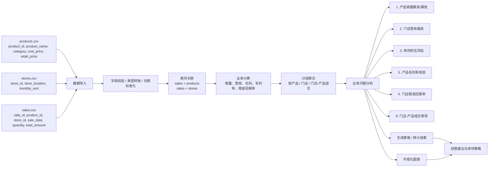

# 流水线方案 — 第 [NUMBER] 组

**项目**： 优化零售库存&销售表现
**成员**： [姓名 1], [姓名 2], [姓名 3], …

## 1. 业务问题

1. 哪些**产品**的销量最高 / 最低？
2. 哪家**门店**创造的营收最多？
3. 哪里存在**库存积压风险**（库存成本高、销量低）？
5. 哪些**产品**的毛利率最高 / 最低？
6. 哪家**门店**的租金回报率最高？
8. 哪些**门店-产品**组合表现最好 / 最差？

## 2. 数据流水线流程图

下面提供两种可视化方式：Mermaid 流程图和 ASCII 图。两者都覆盖了从原始 CSV 读取、清洗与关联、到聚合分析、再到业务洞察与建议的闭环。

### Mermaid 流程图



### ASCII 流程图

```
┌──────────────────────┐     ┌──────────────────────┐     ┌──────────────────────┐
│ products.csv         │     │ stores.csv           │     │ sales.csv            │
│ product_id,          │     │ store_id,            │     │ sale_id,             │
│ product_name,        │     │ store_location,      │     │ product_id,          │
│ category,            │     │ monthly_rent         │     │ store_id,            │
│ cost_price,          │     │                      │     │ sale_date,           │
│ retail_price         │     │                      │     │ quantity,            │
└──────────┬───────────┘     └──────────┬───────────┘     └──────────┬───────────┘
           │                              │                              │
           └───────────────┬──────────────┴───────────────┬───────────────┘
                           │                               │
                           ▼                               ▼
                 ┌──────────────────────────────┐
                 │ 1. 数据导入与清洗             │
                 │ - 统一日期格式                │
                 │ - 字段类型转换                │
                 │ - 缺失值/异常值检查           │
                 └──────────────┬───────────────┘
                                │
                                ▼
                 ┌──────────────────────────────┐
                 │ 2. 表间关联                   │
                 │ sales join products          │
                 │ sales join stores            │
                 │ 构造合并后的事实表             │
                 └──────────────┬───────────────┘
                                │
                                ▼
                 ┌──────────────────────────────┐
                 │ 3. 计算核心指标               │
                 │ - 销量 sum(quantity)         │
                 │ - 营收 sum(total_amount)     │
                 │ - 成本/毛利/毛利率            │
                 │ - 租金回报率                  │
                 └──────────────┬───────────────┘
                                │
                                ▼
                 ┌──────────────────────────────┐
                 │ 4. 分组聚合分析              │
                 │ 按 product / category       │
                 │ 按 store / store_location   │
                 │ 按 date / product-store      │
                 └──────────────┬───────────────┘
                                │
                                ▼
                 ┌──────────────────────────────┐
                 │ 5. 业务问题解答               │
                 │ - 产品销量最高/最低           │
                 │ - 门店营收最高                │
                 │ - 库存积压风险                │
                 │ - 产品毛利率高低              │
                 │ - 门店租金回报率              │
                 │ - 门店-产品组合表现           │
                 └──────────────┬───────────────┘
                                │
                                ▼
                 ┌──────────────────────────────┐
                 │ 6. 结果输出                   │
                 │ - 汇总表格                    │
                 │ - 图表可视化                  │
                 │ - 建议列表                    │
                 └──────────────────────────────┘
```


## 3. 伪代码架构方案

用通俗的中文/英文描述你将要转换为 Python 的逻辑（写入 `03_analysis.py` 的第 4 部分）。
```
BEGIN pipeline

STEP 1: 加载原始数据
- 从 CSV 读取 products, sales, stores
- 统一字段类型：sale_date 转为日期、quantity 转为整数、金额字段转为浮点数

STEP 2: 构建统一事实表
- LEFT JOIN sales 与 products ON product_id
- LEFT JOIN 结果与 stores ON store_id
- 计算关键业务字段：
  - total_profit = total_amount - cost_price * quantity
  - gross_margin_rate = total_profit / total_amount
  - store_roi = total_revenue / monthly_rent
  - product_total_cost = cost_price * quantity

STEP 3: 构建聚合数据表
- product_summary：按 product_name / category 聚合
  - total_units = sum(quantity)
  - total_revenue = sum(total_amount)
  - total_cost = sum(cost_price * quantity)
  - gross_profit = total_revenue - total_cost
  - gross_margin_rate = gross_profit / total_revenue
- store_summary：按 store_location 聚合
  - total_revenue = sum(total_amount)
  - total_units = sum(quantity)
  - monthly_rent = store 的租金
  - roi = total_revenue / monthly_rent
- store_product_summary：按 store_location + product_name 聚合
  - total_units, total_revenue, gross_profit
- inventory_risk_summary：按 product_name 聚合
  - total_units, total_cost, risk_flag

STEP 4: 回答 6 个业务问题
- Q1：按 total_units 排序，取最高和最低销量产品
- Q2：按 total_revenue 排序，选出营收最高门店
- Q3：筛选 total_units 较低 且 total_cost 较高 的产品，标记为库存积压风险
- Q5：按 gross_margin_rate 排序，识别毛利率最高/最低产品
- Q6：按 roi 排序，识别租金回报率最高门店
- Q8：按 store_product_summary 的 total_revenue 排序，识别最佳/最差门店-产品组合

STEP 5: Python 列表/字典结构封装
- product_qty_dict: {product_name: total_units}
- product_margin_list: [{product_name, total_units, gross_profit, gross_margin_rate}]
- store_kpi_list: [{store_location, total_revenue, total_units, monthly_rent, roi}]
- inventory_risk_list: [{product_name, total_units, total_cost, risk_flag}]
- store_product_list: [{store_location, product_name, total_units, total_revenue, gross_profit}]

STEP 6: 分析与可视化输出
- CHART 1: 各门店营收柱状图
- CHART 2: 各产品销量柱状图
- CHART 3: 产品毛利率对比柱状图
- CHART 4: 门店-产品组合营收排行榜
- PRINT 输出：销量前后排名、门店营收冠军、毛利率优劣、库存风险清单、最佳组合清单

END pipeline
```

### 你的伪代码

```python
# 伪代码：分析主流程
products = read_csv('products.csv')
sales = read_csv('sales.csv')
stores = read_csv('stores.csv')

# 1. 类型标准化
sales['sale_date'] = to_datetime(sales['sale_date'])
products['cost_price'] = float(products['cost_price'])
stores['monthly_rent'] = float(stores['monthly_rent'])

# 2. 关联事实表
sales_detail = sales.merge(products, on='product_id', how='left')
sales_detail = sales_detail.merge(stores, on='store_id', how='left')

# 3. 补充业务指标
sales_detail['total_profit'] = sales_detail['total_amount'] - sales_detail['cost_price'] * sales_detail['quantity']
sales_detail['gross_margin_rate'] = sales_detail['total_profit'] / sales_detail['total_amount']

# 4. 分组聚合：回答业务问题
product_summary = group_by(sales_detail, ['product_name'])
product_summary['total_units'] = sum('quantity')
product_summary['total_revenue'] = sum('total_amount')
product_summary['total_cost'] = sum('cost_price' * 'quantity')
product_summary['gross_profit'] = sum('total_profit')
product_summary['gross_margin_rate'] = gross_profit / total_revenue

store_summary = group_by(sales_detail, ['store_location'])
store_summary['total_revenue'] = sum('total_amount')
store_summary['total_units'] = sum('quantity')
store_summary['roi'] = total_revenue / monthly_rent

store_product_summary = group_by(sales_detail, ['store_location', 'product_name'])
store_product_summary['total_revenue'] = sum('total_amount')
store_product_summary['total_units'] = sum('quantity')

# 5. 业务筛选与排序
best_products = sort_desc(product_summary, 'total_units')[:3]
worst_products = sort_asc(product_summary, 'total_units')[:3]

best_store = sort_desc(store_summary, 'total_revenue')[0]

inventory_risk = filter(product_summary,
    total_units <= 3 and total_cost >= 100)

best_margin_products = sort_desc(product_summary, 'gross_margin_rate')[:3]
worst_margin_products = sort_asc(product_summary, 'gross_margin_rate')[:3]

best_roi_store = sort_desc(store_summary, 'roi')[0]

best_store_product = sort_desc(store_product_summary, 'total_revenue')[0]
worst_store_product = sort_asc(store_product_summary, 'total_revenue')[0]

# 6. 数据结构化输出
product_qty_dict = dict(product_summary[['product_name', 'total_units']])
product_margin_list = to_list_of_dicts(product_summary)
store_kpi_list = to_list_of_dicts(store_summary)
inventory_risk_list = to_list_of_dicts(inventory_risk)
store_product_list = to_list_of_dicts(store_product_summary)

# 7. 结果展示
plot_store_revenue(store_summary)
plot_top_products(product_summary)
plot_margin_products(product_summary)
print(best_store, inventory_risk, best_margin_products, best_roi_store, best_store_product)
```

## 4. 伪代码 → Python 映射表

|伪代码步骤|Python结构（list/dict/Pandas）|
|:-:|:-:|
|读取 CSV 原始表|`products, sales, stores = pd.read_csv(...)`|
|构造合并事实表|`df = sales.merge(products, on='product_id').merge(stores, on='store_id')`|
|计算利润率 / ROI|`df['gross_margin_rate'] = ...`, `df['roi'] = ...`|
|按产品聚合销量|`df.groupby('product_name').agg(total_units=('quantity', 'sum'))`|
|按门店聚合营收|`df.groupby('store_location').agg(total_revenue=('total_amount', 'sum'))`|
|构建产品销量字典|`product_qty: dict[str, int] = {}`|
|构建门店 KPI 列表|`store_kpis: list[dict] = []`|
|构建产品毛利率列表|`product_margin_list: list[dict] = []`|
|构建库存风险列表|`inventory_risk_list: list[dict] = []`|
|构建门店-产品组合列表|`store_product_list: list[dict] = []`|
|筛选排序|`sorted(..., key=lambda x: x['total_revenue'], reverse=True)`|


## 5. 预期产出

|产出|格式|受众|说明|
|:-:|:-:|:-:|:-:|
|产品销量排名|表格 / 控制台|运营经理、销售团队|输出销量最高和最低的产品名称及对应销量，便于补货和促销决策。|
|门店营收排名|表格 / 控制台|运营经理|输出各门店营收总额和排序，判断业绩领先门店。|
|库存积压风险清单|字典列表 / 表格|库存团队|筛选销量低且单位成本高的产品，识别高风险滞销商品。|
|产品毛利率排名|表格 / 控制台|采购与财务团队|识别毛利率最高/最低的产品，支持定价和产品组合优化。|
|门店租金回报率排名|表格 / 控制台|门店管理层|衡量各门店营收与租金的投入产出效率。|
|门店-产品组合表现|表格 / 控制台|门店运营团队|识别哪个门店与哪个产品组合表现最强/最弱，支持针对性营销。|
|图表 1：门店营收柱状图|PNG|汇报展示|展示各门店营收对比，突出业绩差异。|
|图表 2：产品销量柱状图|PNG|汇报展示|用于展示销量前列产品和低销量产品。|
|图表 3：产品毛利率对比图|PNG|汇报展示|帮助快速比较不同产品的盈利能力。|
|图表 4：门店-产品组合营收图|PNG|汇报展示|展示最佳和最差组合的表现差异，便于汇报。|
