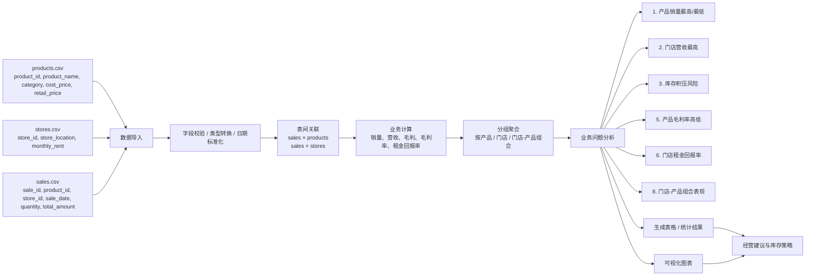

# 流水线方案 — 第 [NUMBER] 组

**项目**： 优化零售库存&销售表现
**成员**： [姓名 1], [姓名 2], [姓名 3], …

## 1. 业务问题

1. 哪些**产品**的销量最高 / 最低？
2. 哪家**门店**创造的营收最多？
3. 哪里存在**库存积压风险**（库存成本高、销量低）？
5. 哪些**产品**的毛利率最高 / 最低？
6. 哪家**门店**的租金回报率最高？
8. 哪些**门店-产品**组合表现最好 / 最差？

## 2. 数据流水线流程图

下面提供两种可视化方式：Mermaid 流程图和 ASCII 图。两者都覆盖了从原始 CSV 读取、清洗与关联、到聚合分析、再到业务洞察与建议的闭环。

### Mermaid 流程图



### ASCII 流程图

```
┌──────────────────────┐     ┌──────────────────────┐     ┌──────────────────────┐
│ products.csv         │     │ stores.csv           │     │ sales.csv            │
│ product_id,          │     │ store_id,            │     │ sale_id,             │
│ product_name,        │     │ store_location,      │     │ product_id,          │
│ category,            │     │ monthly_rent         │     │ store_id,            │
│ cost_price,          │     │                      │     │ sale_date,           │
│ retail_price         │     │                      │     │ quantity,            │
└──────────┬───────────┘     └──────────┬───────────┘     └──────────┬───────────┘
           │                              │                              │
           └───────────────┬──────────────┴───────────────┬───────────────┘
                           │                               │
                           ▼                               ▼
                 ┌──────────────────────────────┐
                 │ 1. 数据导入与清洗             │
                 │ - 统一日期格式                │
                 │ - 字段类型转换                │
                 │ - 缺失值/异常值检查           │
                 └──────────────┬───────────────┘
                                │
                                ▼
                 ┌──────────────────────────────┐
                 │ 2. 表间关联                   │
                 │ sales join products          │
                 │ sales join stores            │
                 │ 构造合并后的事实表             │
                 └──────────────┬───────────────┘
                                │
                                ▼
                 ┌──────────────────────────────┐
                 │ 3. 计算核心指标               │
                 │ - 销量 sum(quantity)         │
                 │ - 营收 sum(total_amount)     │
                 │ - 成本/毛利/毛利率            │
                 │ - 租金回报率                  │
                 └──────────────┬───────────────┘
                                │
                                ▼
                 ┌──────────────────────────────┐
                 │ 4. 分组聚合分析              │
                 │ 按 product / category       │
                 │ 按 store / store_location   │
                 │ 按 date / product-store      │
                 └──────────────┬───────────────┘
                                │
                                ▼
                 ┌──────────────────────────────┐
                 │ 5. 业务问题解答               │
                 │ - 产品销量最高/最低           │
                 │ - 门店营收最高                │
                 │ - 库存积压风险                │
                 │ - 产品毛利率高低              │
                 │ - 门店租金回报率              │
                 │ - 门店-产品组合表现           │
                 └──────────────┬───────────────┘
                                │
                                ▼
                 ┌──────────────────────────────┐
                 │ 6. 结果输出                   │
                 │ - 汇总表格                    │
                 │ - 图表可视化                  │
                 │ - 建议列表                    │
                 └──────────────────────────────┘
```


## 3. 伪代码架构方案

用通俗的中文/英文描述你将要转换为 Python 的逻辑（写入 `03_analysis.py` 的第 4 部分）。
```
BEGIN pipeline

STEP 1: 加载关系表
- 从 CSV 读取 products, sales, stores

STEP 2: SQL 层 (或 Pandas 等价连接)
- JOIN sales 与 products ON product_id
- JOIN sales 与 stores ON store_id
- 如需要，按日期范围 FILTER
- GROUP BY store_location, product_name
- COMPUTE sum(quantity), sum(total_amount), 利润估算
- HAVING 总销量低于阈值 → 标记为滞销品

STEP 3: Python 数据组织 (列表与字典)
- BUILD 字典: key = product_name, value = 总销量
- BUILD 字典列表: 每家门店一个字典，包含 KPI
- 按营收降序 SORT 列表

STEP 4: 分析与可视化
- CHART 1: 柱状图 — 各门店营收
- CHART 2: 柱状图或折线图 — 销量最高的产品
- 根据滞销品列表 PRINT 库存建议

END pipeline
```


### 你的伪代码

```
BEGIN pipeline

STEP 1: 加载原始数据
- 从 CSV 读取 products, sales, stores
- 统一字段类型：sale_date 转为日期、quantity 转为整数、金额字段转为浮点数

STEP 2: 构建统一事实表
- LEFT JOIN sales 与 products ON product_id
- LEFT JOIN 结果与 stores ON store_id
- 计算关键业务字段：
  - total_profit = total_amount - cost_price * quantity
  - gross_margin_rate = total_profit / total_amount
  - store_roi = total_revenue / monthly_rent
  - product_total_cost = cost_price * quantity

STEP 3: 构建聚合数据表
- product_summary：按 product_name / category 聚合
  - total_units = sum(quantity)
  - total_revenue = sum(total_amount)
  - total_cost = sum(cost_price * quantity)
  - gross_profit = total_revenue - total_cost
  - gross_margin_rate = gross_profit / total_revenue
- store_summary：按 store_location 聚合
  - total_revenue = sum(total_amount)
  - total_units = sum(quantity)
  - monthly_rent = store 的租金
  - roi = total_revenue / monthly_rent
- store_product_summary：按 store_location + product_name 聚合
  - total_units, total_revenue, gross_profit
- inventory_risk_summary：按 product_name 聚合
  - total_units, total_cost, risk_flag

STEP 4: 回答 6 个业务问题
- Q1：按 total_units 排序，取最高和最低销量产品
- Q2：按 total_revenue 排序，选出营收最高门店
- Q3：筛选 total_units 较低 且 total_cost 较高 的产品，标记为库存积压风险
- Q5：按 gross_margin_rate 排序，识别毛利率最高/最低产品
- Q6：按 roi 排序，识别租金回报率最高门店
- Q8：按 store_product_summary 的 total_revenue 排序，识别最佳/最差门店-产品组合

STEP 5: Python 列表/字典结构封装
- product_qty_dict: {product_name: total_units}
- product_margin_list: [{product_name, total_units, gross_profit, gross_margin_rate}]
- store_kpi_list: [{store_location, total_revenue, total_units, monthly_rent, roi}]
- inventory_risk_list: [{product_name, total_units, total_cost, risk_flag}]
- store_product_list: [{store_location, product_name, total_units, total_revenue, gross_profit}]

STEP 6: 分析与可视化输出
- CHART 1: 各门店营收柱状图
- CHART 2: 各产品销量柱状图
- CHART 3: 产品毛利率对比柱状图
- CHART 4: 门店-产品组合营收排行榜
- PRINT 输出：销量前后排名、门店营收冠军、毛利率优劣、库存风险清单、最佳组合清单

END pipeline
```


## 4. 伪代码 → Python 映射表

|伪代码步骤|Python结构（list/dict/Pandas）|
|:-:|:-:|
|例：“BUILD 产品→销量 字典”|`product_qty: dict[str, int] = {}`|
|例：“BUILD 门店 KPI 字典列表”|`store_kpis: list[dict] = []`|
||
||


## 5. 预期产出

|产出|格式|受众|
|:-:|:-:|:-:|
|门店业绩汇总|表格 / 控制台|运营经理|
|滞销产品清单|字典列表|库存团队|
|图表 1|PNG|汇报展示|
|图表 2|PNG|汇报展示|
